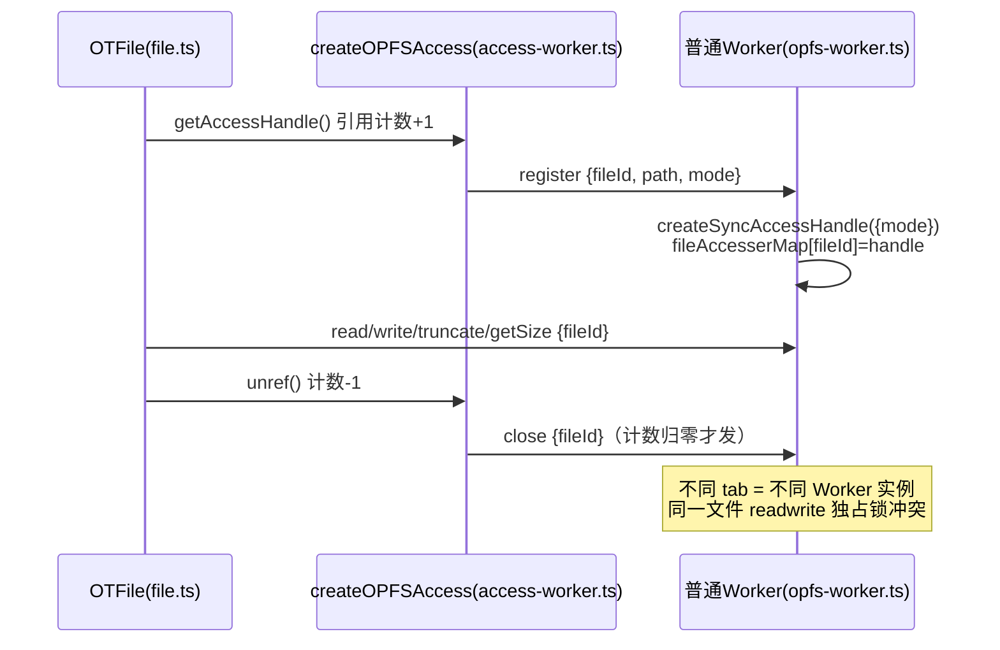
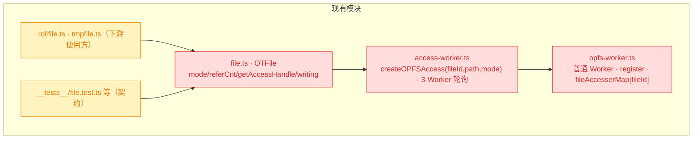
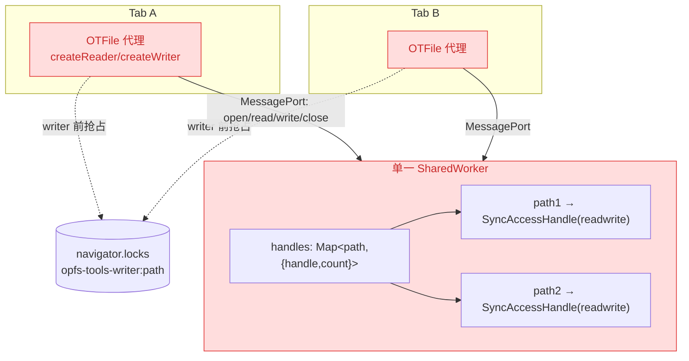
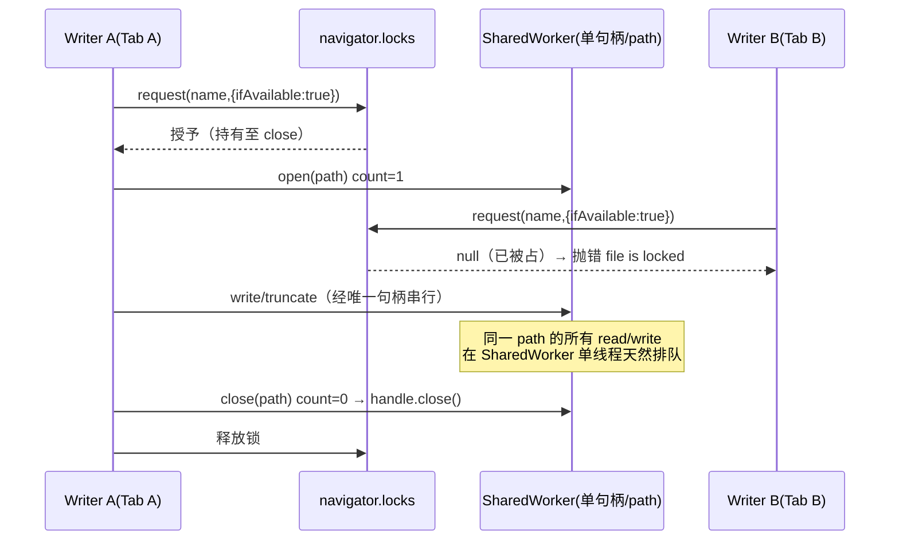
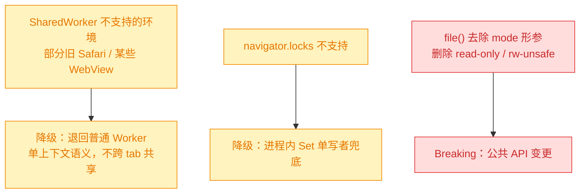

# 跨 Tab 共享文件句柄重构（SharedWorker + Web Locks）

## 1. 背景

当前 OPFS 文件句柄通过普通 Worker（`opfs-worker.ts`）获取，每个 `OTFile` 实例以自增 `fileId` 独立 `createSyncAccessHandle({ mode })`。由此产生两类报错：

- 同一文件连续创建只读句柄（`r`）与默认读写句柄（`rw`）时，read-only 与 readwrite 锁互斥 → 抛错。
- 跨多个 tab 对同一文件创建句柄时，`readwrite` 为 origin 级独占锁 → 抛错。

根因：句柄按实例（`fileId`）隔离、普通 Worker 不跨 tab 共享，且最多 3 个 Worker 轮询分发导致同一路径的句柄散落在不同 Worker、无法集中协调。

## 2. 需求

用 SharedWorker 替代普通 Worker，让全 origin（多 tab、多 `OTFile` 实例）共享同一文件的唯一句柄：

1. SharedWorker 对文件句柄 `open`（替代 `register`）/`close` 计数，归零时关闭句柄；移除 `file.ts` 中的引用计数。
2. 用 `filePath` 替代 `fileId`，并确保相同 `filePath` 分配到相同 SharedWorker 实例。
3. （可选）SharedWorker 实例数量可变 `[1,10]`，阻塞时新建、空闲时销毁（保留 3 个空闲）；实现复杂可暂放弃。
4. `file.ts` 的 reader/writer 直接代理给 SharedWorker：
   - 并发 read 自动排队（全 origin 共享唯一句柄，操作天然串行）。
   - 禁止并发写：writer 创建前先获取全局锁（Web Locks API），文件已被锁则直接抛错。
5. 大幅简化 `file.ts`，移除：引用计数、accessHandle 复用、mode、writing。

## 3. 现状分析

### 3.1 现有调用链路

`file.ts` 的 `OTFile` 持有 per-instance 的 `#getAccessHandle`（惰性创建 + 引用计数 + `#unsafeClose`），通过 `access-worker.ts` 的 `createOPFSAccess(fileId, path, mode)` 向普通 Worker 发 `register`，Worker 以 `fileAccesserMap[fileId]` 保存句柄。reader/writer 的每个操作转成一条 `postMessage`。



### 3.2 现有模块结构与影响面



<details>
<summary>精确层：关键位置与现状行为</summary>

- `src/file.ts:30` `file(filePath, mode='rw')`：仅 `rw` 按 path 缓存；`r`/`rw-unsafe` 每次 new 实例。
- `src/file.ts:129-171` `#referCnt` / `#unsafeClose` / `#getAccessHandle`：惰性建句柄 + 引用计数 + unref 关闭。
- `src/file.ts:173-224` `createWriter`：`#writing` 互斥 + `read-only` 禁写。
- `src/file.ts:298-308` `remove`：`#referCnt>0` 抛 `exists unclosed reader/writer`；`force` 走 `#unsafeClose`。
- `src/access-worker.ts:13-57` `OpenMode` / `createOPFSAccess(fileId,path,mode)`；`:59-71` 最多 3 个普通 Worker 轮询。
- `src/opfs-worker.ts:3-21` `fileAccesserMap[fileId]`、`register` → `createSyncAccessHandle({mode})`。
- 下游：`rollfile.ts:7-8`（同时持 writer+reader）、`tmpfile.ts:17`（createWriter 清空）。
- 既有测试契约（将受影响）：`file.test.ts` 的 `write operation is exclusive`(L80)、`random access`(L132)、`multiple handler for single file`(L226)、`read-only file dont write`(L238)、`unsafe write same file`(L244)、`remove file when unclos reader`(L256)、`force remove file`(L267)。
- 现有已用 Web Locks 的范式：`tmpfile.ts` 的 `holdFileLock`/`isFileHeld`（`navigator.locks.request` + `ifAvailable`，不支持时优雅降级）。

</details>

## 4. 技术实现方案

### 4.1 总体思路

全 origin 单一 SharedWorker 持有「每个 path 唯一」的 `readwrite` SyncAccessHandle，所有 tab 的所有 `OTFile` 都通过它读写；句柄按 path 做 `open`/`close` 计数，归零即真正 `close`。`OTFile` 退化为「无状态代理」：不再持句柄、不再引用计数、不再区分 mode。写并发控制上移到主线程用 Web Locks 做 origin 级单写者互斥。



### 4.2 写并发控制与读排队时序



### 4.3 SharedWorker 协议（open/close 计数）

以 `path` 为键维护 `{ handle, count }`。连接通过 `onconnect` 建立每 tab 一个 `MessagePort`，消息体均带 `path` 与 `cbId`。

- `open`：无句柄则 `createSyncAccessHandle()`（默认 readwrite），`count` 置 0；随后 `count++`。
- `close`：`count--`，归零 → `handle.close()` 并从 Map 删除。
- `read`/`write`/`truncate`/`getSize`/`flush`：按 `path` 取句柄执行。
- `forceClose`：无视 count 立即关闭并删除（供 `remove({force:true})`）。
- `isOpen`：返回 `count>0`（供 `remove` 非强制时的占用校验，替代 `#referCnt`）。

<details>
<summary>精确层：SharedWorker 状态与消息契约</summary>

```ts
// opfs-worker.ts（改为 SharedWorker 入口）
const handles = new Map<
  string,
  { handle: FileSystemSyncAccessHandle; count: number }
>();
self.onconnect = (e) => {
  const port = e.ports[0];
  port.onmessage = async ({ data }) => {
    /* evtType: open|close|read|write|truncate|getSize|flush|forceClose|isOpen */
  };
  port.start?.();
};
```

- `open`：`getFSHandle(path,{create:true,isFile:true})` → `createSyncAccessHandle()`；入 Map、`count++`。
- `close`：`count--`；`if(count<=0){ await handle.close(); handles.delete(path); }`。
- 错误沿用 `{evtType:'throwError', cbId, errMsg}` 回传。

</details>

### 4.4 access-worker.ts：SharedWorker 连接与 path 路由

`createOPFSAccess(filePath)` 去除 `fileId`/`mode`，改为通过 SharedWorker 的 `MessagePort` 收发，消息按 `cbId` 多路复用、按 `filePath` 定位句柄。需求 #2「相同 path → 相同实例」在单实例下天然成立；预留 `pickWorker(path)=hash(path)%poolSize` 钩子，poolSize 现为 1。

<details>
<summary>精确层：连接建立与路由钩子</summary>

```ts
// Vite：new SharedWorker(new URL('./opfs-worker.ts', import.meta.url), { type: 'module' })
// 或沿用内联：import OPFSSharedWorker from './opfs-worker?sharedworker&inline'
// 单连接多路复用：cbId -> {resolve,reject}；postMsg(evtType,{path,...})
// 路由钩子（为 #3 预留，现 poolSize=1）：function pickPort(path){ return ports[hash(path)%ports.length]; }
```

</details>

### 4.5 file.ts 简化

`OTFile` 构造仅解析 path。删除 `#mode`/`#id`/`#referCnt`/`#unsafeClose`/`#getAccessHandle`/`#writing`。

- `file(filePath)`：去掉 `mode` 形参，一律按 path 缓存。
- `createReader()`：`open(path)` → 读操作代理；`close()` → `close(path)`。不加锁。
- `createWriter()`：先抢 Web Lock（`ifAvailable:true`，拿不到即抛 `file is locked`），再 `open(path)`；`close()` 释放锁并 `close(path)`。
- `remove()`：非强制时经 `isOpen(path)` 校验，占用则抛 `exists unclosed reader/writer`；`force` 走 `forceClose(path)` 后删除。
- `text/arrayBuffer/stream/getSize/exists` 维持经 `getFile()` 的免锁实现，不改。

<details>
<summary>精确层：Web Lock 持有/释放范式（含不支持降级）</summary>

```ts
const LOCK_PREFIX = 'opfs-tools-writer:';
async function acquireWriteLock(path: string): Promise<() => void> {
  if (globalThis.navigator?.locks == null) return localFallbackLock(path); // 无 Web Locks：进程内 Set 兜底
  let release!: () => void;
  const granted = await new Promise<boolean>((resolve) => {
    navigator.locks
      .request(`${LOCK_PREFIX}${path}`, { ifAvailable: true }, (lock) => {
        if (lock == null) {
          resolve(false);
          return;
        }
        resolve(true);
        return new Promise<void>((r) => (release = r)); // 持有至 writer.close()
      })
      .catch(() => resolve(false));
  });
  if (!granted) throw Error(`file is locked by another writer: ${path}`);
  return () => release();
}
```

</details>

### 4.6 兼容性 / 影响范围



### 4.7 决策记录（准入门槛过滤后，由实现者判定）

> 决策记录：需求 #3 动态实例池 [1,10] —— **暂放弃**（用户已授权"实现复杂可暂放弃"）。MVP 采用单一 SharedWorker，天然满足 #2「同 path 同实例」；代码预留 `pickPort(path)=hash%N` 路由钩子，后续可平滑扩为固定/动态池。理由：单实例即满足"跨 tab 共享唯一句柄"核心目标，动态扩缩（阻塞探测/空闲回收/跨实例句柄迁移）复杂且收益为并发优化，非正确性必需。

> 决策记录：移除 `mode`（read-only / rw-unsafe）—— **按用户明确指令执行**。这是对已发布库（v0.7.5）公共 API 的 breaking change：`file(path, mode)` 变为 `file(path)`，`read-only` 写保护与 `rw-unsafe` 多句柄并发能力移除。相应删除/改写依赖 mode 的测试用例。理由：新模型下全 origin 唯一句柄 + Web Locks 单写者，mode 的隔离语义已由统一机制取代；保留 mode 形参会与"唯一句柄"模型自相矛盾。

> 决策记录：SharedWorker / Web Locks 不支持环境 —— **优雅降级**（与 `tmpfile.ts` 既有降级约定一致）：无 SharedWorker 时退回普通 Worker（仅单上下文语义）；无 `navigator.locks` 时用进程内 Set 兜底单写者。理由：遵循仓库既有"能力探测 + 降级"约定，避免在低版本环境直接不可用。

## 5. 待确认项

_暂无_

## 6. 任务清单

- [x] 将 `src/opfs-worker.ts` 改为 SharedWorker 入口：`onconnect` 建 port，以 `handles: Map<path,{handle,count}>` 实现 open/close/read/write/truncate/getSize/flush/forceClose/isOpen（验收：无 fileId/register/mode 残留，tsc 通过）
- [x] 重写 `src/access-worker.ts`：删除 `fileId`/`OpenMode`/mode，导出 `createOPFSAccess(filePath)`，建立单 SharedWorker 连接并按 cbId 多路复用、按 path 定位；预留 `pickPort(path)` 路由钩子（poolSize=1）（验收：grep 无 fileId/mode，tsc 通过）
- [x] 为 SharedWorker/Web Locks 不支持环境加降级：无 SharedWorker 时退回普通 Worker 连接适配；无 `navigator.locks` 时进程内 Set 兜底单写者（验收：能力探测分支存在，tsc 通过）
- [x] 简化 `src/file.ts`：删除 `#mode`/`#id`/`#referCnt`/`#unsafeClose`/`#getAccessHandle`/`#writing` 与 `ShortOpenMode`，`file(filePath)` 去 mode 形参按 path 缓存（验收：grep 无 mode/referCnt/writing）
- [x] `src/file.ts` reader/writer 改为代理 SharedWorker：`createReader` open/close 不加锁；`createWriter` 先抢 Web Lock（ifAvailable，占用抛 `file is locked`）、close 释放锁（验收：并发第二个 writer 抛错）
- [x] `src/file.ts` `remove()` 改造：非强制经 `isOpen(path)` 校验占用抛 `exists unclosed reader/writer`，`force` 走 `forceClose(path)`（验收：对应测试通过）
- [x] 适配下游：确认 `src/rollfile.ts`、`src/tmpfile.ts` 无 mode 依赖且 reader+writer 并存可用（验收：tsc 通过，相关测试通过）
- [x] 更新受影响测试：改写/删除 `src/__tests__/file.test.ts` 中依赖 mode 的用例（`multiple handler`/`read-only dont write`/`unsafe write`），对齐 writer 锁报错文案与 `remove` 校验（验收：vitest 相关用例通过或记录环境限制）
- [x] 运行 `tsc -p tsconfig.build.json` 与 `pnpm build`，并尝试 `pnpm test`（验收：类型/构建通过，测试结果或环境限制记录入执行记录）
- [ ] [manual] 浏览器多 tab 手测：两个 tab 对同一文件并发写验证第二个抛锁错、读可并发、关闭页面后锁自动释放（验收：人工确认）

## 7. 执行记录

- SharedWorker 入口（`src/opfs-worker.ts`）：改为 `handles: Map<path,{handle,count}>`，`open` 替代 `register`（首次 `createSyncAccessHandle()`、之后计数++），`close` 计数归零即 `handle.close()`，新增 `forceClose`/`isOpen`；按 `SharedWorkerGlobalScope` 运行时探测走 `onconnect`，否则降级 `onmessage`。验证：tsc 通过。
- 访问层（`src/access-worker.ts`）：`createOPFSAccess(filePath)` 去除 `fileId`/`mode`；单 SharedWorker 连接 + cbId 多路复用，`pickWorker(path)` 路由钩子（poolSize=1，相同 path 天然同实例）；新增 `postToOPFS(path,'isOpen'|'forceClose')`；`SharedWorker` 不可用时降级 `?worker&inline`。验证：tsc 通过。
- 简化 `src/file.ts`：删除 `mode`/`#id`/`#referCnt`/`#unsafeClose`/`#getAccessHandle`/`#writing`/`ShortOpenMode`；`file(filePath)` 去 mode 按 path 缓存；新增 `acquireWriteLock`（Web Locks `ifAvailable`，占用抛 `file is locked by another writer`，无 locks 时 Set 兜底）；reader 不加锁、writer close 释放锁；`remove` 占用校验下沉 SharedWorker。验证：tsc 通过。
- 下游：`rollfile.ts`/`tmpfile.ts`/`index.ts` 无需改动（无 mode 依赖），`demo/test.ts` 去除 `rw-unsafe` 参数。
- 测试：`src/__tests__/file.test.ts` 更新锁报错文案、改写 `multiple handler`、删除 `read-only dont write`、`unsafe write` 改为 `sequential writes`。
- 构建/类型：`tsc --noEmit -p tsconfig.json` 通过；`tsc -p tsconfig.build.json`（声明）通过；`vite build` 通过。
- ⚠️ 打包影响：SharedWorker 不可内联（各 tab blob URL 不同将无法跨 tab 共享），故产物从单文件内联变为额外产出独立资源 `dist/assets/opfs-worker-*.js`（`vite build` 已确认）；ESM 下由消费方打包器按 `import.meta.url` 解析，UMD 场景 worker 资源解析能力有限。
- ⚠️ 运行时测试未能在本环境执行：`npx vitest run`（headless，chrome 缺失且内置浏览器）报 `fh.createSyncAccessHandle is not a function`——沙箱浏览器缺少 OPFS SyncAccessHandle API（既有测试同样依赖该 API，在此环境也会同样失败），非本次逻辑问题。运行时正确性以 `[manual]` 浏览器多 tab 手测兜底。
- 收尾：非 `[manual]` 任务全部完成，待确认项为空、无批注、无追加任务 `[open]`，标记 `stage=done`。遗留 1 项 `[manual]` 浏览器多 tab 手测待人工验证（不阻断 done）。
