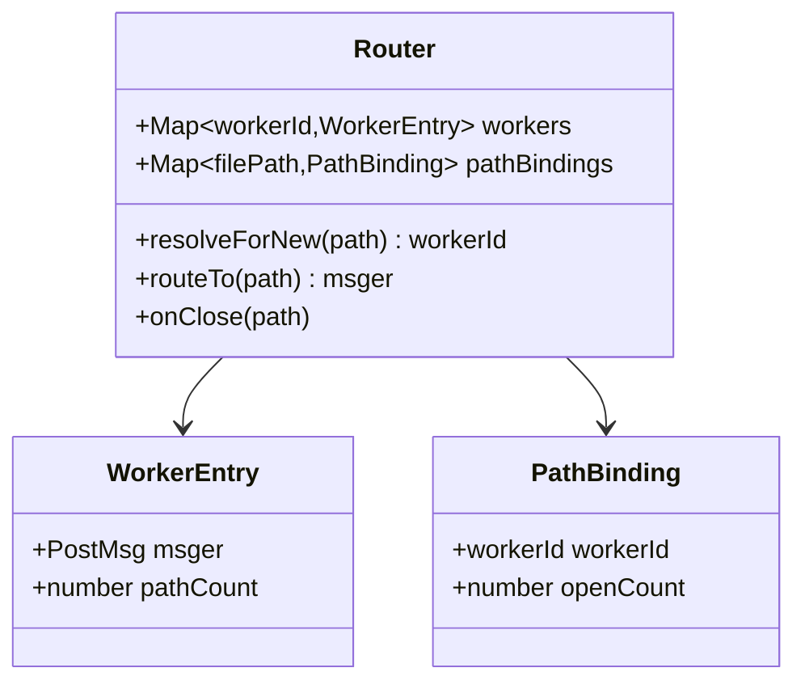
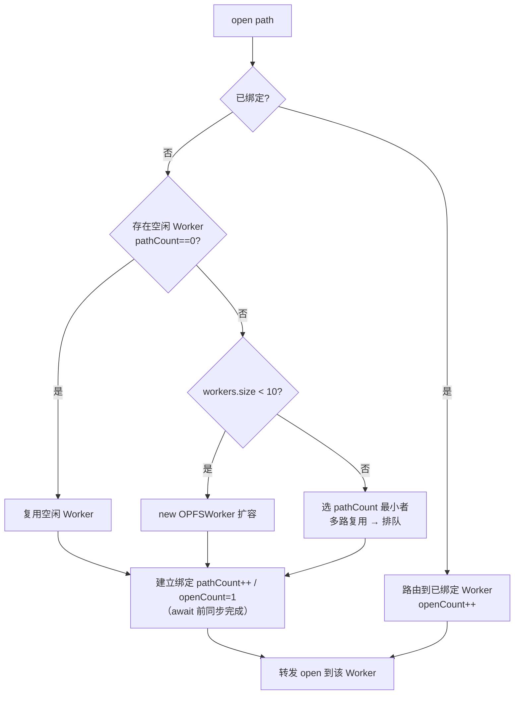
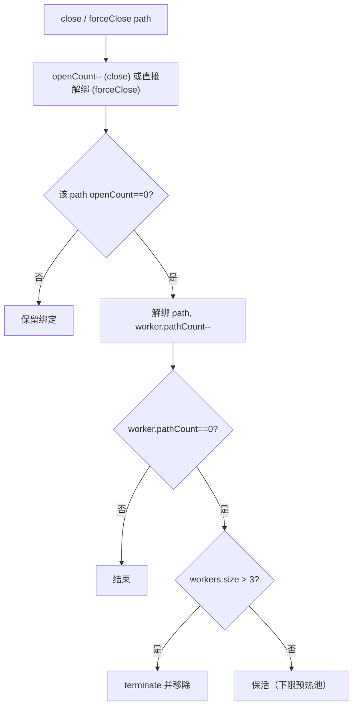
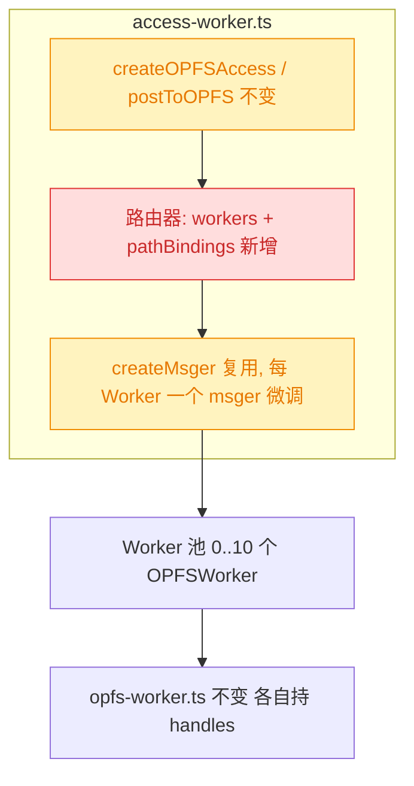

# 动态 Worker 池与 path 粘性路由

## 1. 背景

`src/access-worker.ts` 目前通过 `getWorker()` 懒加载**单个**内联 Dedicated Worker（`msger`），所有文件 path 的 `open/read/write/close` 等消息都经由这唯一的 Worker 线程串行处理。单线程串行成为多文件并发 I/O 的瓶颈。

用户希望：Worker 数量可动态增减——从 0 开始按需增加、最多 10 个、超出则排队；空闲时动态缩减、下限 3 个、空闲实例销毁。关键约束：**同一个文件 path 必须始终路由到同一个 Worker 实例**（否则 Worker 内「按 path 持唯一句柄 + 引用计数」的正确性被破坏）。

## 2. 需求

- Worker 数量动态增加：从 0 起按需增长，上限 **10** 个；需求超过上限时「排队」而非再增 Worker。
- Worker 数量动态缩减：空闲实例销毁，缩减下限 **3** 个。
- 路由粘性：同一 `filePath` 的全部消息（`open/read/write/close/truncate/getSize/flush/isOpen/forceClose`）在其存活期内恒定命中同一 Worker 实例。
- 对外保持 `createOPFSAccess(filePath)` 与 `postToOPFS(filePath, evtType)` 的现有签名不变（`src/file.ts` 不需改动）。

## 3. 现状分析

### 3.1 当前结构与数据流

- `access-worker.ts`
  - `getWorker()`：懒加载并返回全局唯一 `msger`（`PostMsg`）。
  - `createMsger()`：`new OPFSWorker()` + 回调协议（`cbId`→`cbFns`，`onmessage` 按 `evtType` resolve/reject，`onerror` 拒绝全部挂起回调）。
  - 对外入口：`createOPFSAccess(filePath)`（先 `open` 再返回读写代理）、`postToOPFS(filePath, 'isOpen'|'forceClose')`。
- `opfs-worker.ts`
  - `handles: Map<filePath, { handleP, count }>`：**每个 Worker 内部**按 path 持唯一 `SyncAccessHandle` 并引用计数，`count` 归零即真正 `close()`。
  - `open` 在任何 `await` 前同步写入 Map，保证并发 `open` 复用同一创建 Promise（抗竞态）。
- `file.ts` 消费：`createWriter`/`createReader` → `createOPFSAccess`；`remove` → `postToOPFS`。

### 3.2 关键不变量（改造必须保持）

- **同一 path → 同一 Worker**：当前仅一个 Worker，天然成立。引入多 Worker 后，Worker 内的 `handles` Map 与 `count` 仅在「同一 path 的消息恒定命中同一实例」时才正确；一旦同 path 跨实例，句柄与计数分裂，`isOpen`/`forceClose`/`close` 全部失真。
- `open` 的同步占位（await 前写 Map）语义：路由侧为新 path 选 Worker、建立绑定的动作也必须在 `await` 前**同步完成**，避免并发 `open` 把同一新 path 绑到不同 Worker。

现状精确信息（文件 / 行号 / 入口）

- 单例与工厂：`src/access-worker.ts:56-60`（`msger` / `getWorker`）、`:62-105`（`createMsger`）。
- 对外入口：`src/access-worker.ts:26-44`（`createOPFSAccess`）、`:47-52`（`postToOPFS`）。
- Worker 内句柄与计数：`src/opfs-worker.ts:7-10`（`handles`）、`:30-70`（`open/close/forceClose/isOpen`）。
- 消费方：`src/file.ts:154,197`（`createOPFSAccess`）、`:268,274`（`postToOPFS`）。
- `opfs-worker.ts` 本身**无需修改**：每个池内 Worker 都加载同一份 worker 代码，各自维护自己的 `handles`。

## 4. 技术实现方案

在 `access-worker.ts` 内引入「Worker 池 + path 粘性路由器」，`opfs-worker.ts` 与对外 API 均不变。核心是用一张 `path → worker` 绑定表取代原单例，使路由稳定、且随扩缩不迁移活跃 path。

### 4.1 路由稳定性策略（为何不用 hash 取模）

若用 `hash(path) % workerCount` 路由，Worker 数量一变（扩/缩）同一 path 会被重新映射到别的 Worker，违反粘性约束。故采用**显式粘性绑定表**：path 首次 `open` 时分配一个 Worker 并记录绑定，绑定在该 path 的 `openCount` 归零（或 `forceClose`）前不变；扩容只影响**新 path** 的分配、缩容只销毁**无绑定**的空闲 Worker，二者都不触碰活跃 path。该策略天然满足「同一 path → 同一 Worker」，与 Worker 内既有引用计数模型同构。

### 4.2 池状态与数据模型

主线程维护两张表与常量：

- `workers: Map<workerId, WorkerEntry>`，`WorkerEntry = { msger, pathCount }`（`pathCount` = 当前绑定到该 Worker 的活跃 path 数）。
- `pathBindings: Map<filePath, { workerId, openCount }>`（`openCount` = 该 path 的 open 净计数，与 Worker 内 `count` 对应）。
- `MAX_WORKERS = 10`、`MIN_WORKERS = 3`。

### 4.3 Worker 选择与「扩容/排队」

新 path 在 `open` 时选 Worker（目标：先铺满并行度，再多路复用排队）：

1. 若存在 `pathCount === 0` 的空闲 Worker → 复用它。
2. 否则若 `workers.size < MAX_WORKERS` → `new OPFSWorker()` 新建一个并用它。
3. 否则（已达 10 个且都有负载）→ 选 `pathCount` 最小的 Worker 复用；该 path 的消息与既有 path 在同一 Worker 线程内**串行排队**——即需求所称「多余就排队」（Worker 单线程天然串行，不阻塞 `open`，规避 11 个文件同时打开时的死锁风险）。

### 4.4 生命周期与「空闲缩减」

- `open`：按 4.3 解析/分配（**同步**建立绑定后再 `await` 转发 `open`）。
- `read/write/truncate/getSize/flush`：查 `pathBindings` 命中已绑定 Worker 转发；未绑定则与现状一致由 Worker 抛 `file not opened`。
- `close`：`openCount--`；归零则解绑、`pathCount--`；若该 Worker `pathCount===0` 成为空闲 → 按缩减策略尝试销毁。
- `forceClose`：无视计数直接解绑该 path、`pathCount--`，转发 `forceClose`；同样触发空闲销毁判定。
- `isOpen`：path 已绑定则转发给其 Worker 查询；未绑定直接返回 `false`（无 Worker 可问）。
- **预热（下限恒为 3，用户决策见 4.6）**：池从 0 懒启动；首次为新 path 建绑定前先将池补齐到 `MIN_WORKERS=3`（`ensurePrewarm`）。此后即便所有 path 关闭、整体完全空闲，缩减也恒保留 3 个空闲 Worker 作为常驻预热池。
- **缩减**：Worker 空闲（`pathCount===0`）时尝试销毁（`worker.terminate()` 并从 `workers` 移除），但保持 `workers.size >= MIN_WORKERS`（下限内的空闲 Worker 保活，作为常驻预热池，避免再次访问冷启动抖动）。

### 4.5 改造后总体结构与影响面

- 🔴 breaking（内部实现，对外 API 不破坏）：`getWorker` 单例被路由器取代，`access-worker.ts` 核心控制流重写。
- 🟡 affected：`createOPFSAccess`/`postToOPFS` 内部由「取单例」改为「按 path 路由」；`createMsger` 调整为可被多实例复用并暴露 `terminate`、Worker 死亡时回调路由器清理绑定。
- 不变：`opfs-worker.ts`、`file.ts` 对外签名、Worker 内句柄/计数协议。

### 4.6 已自行决策的点（非待确认项）

- **「排队」= Worker 内多路复用串行**，而非「阻塞 open 直到有空闲 Worker」：后者会在同时打开 >10 个文件且长期持有时造成死锁，不符合文件库语义。
- **选择策略 = 空闲优先 → 扩容 → 最小负载**：在 ≤10 范围内最大化并行度，超出后用最小负载实现均衡排队。
- **缩减时机 = 空闲即判定销毁**（无额外 idle 定时器），实现简单；下限 3 的预热池已能吸收常见的 close/reopen 抖动。
- **Worker 死亡处理**：某 Worker `onerror` 时，除拒绝其挂起回调外，路由器移除该 Worker 并解绑其名下所有 path，使后续 `open` 可重新分配（不就地重建以免错误循环，下次 `open` 的 `ensurePrewarm` 会把池补回下限）。

> 决策记录：待确认项「"完全空闲"时是否保持下限 3 个常驻」—— 用户选择「下限恒为 3：一旦预热过，即便完全空闲也常驻 3 个 Worker 作为预热池」，接受长期占用 3 个 Worker 线程/内存以换取再次访问的最快响应。据此 4.4 采用「首次访问预热到 3 + 缩减下限恒为 3」。

改造点精确清单（实施参考）

- `src/access-worker.ts`
  - 删除 `msger` 单例与 `getWorker`（`:56-60`），新增 `workers`/`pathBindings` 两表与 `MAX_WORKERS=10`/`MIN_WORKERS=3`。
  - `createMsger`（`:62-105`）调整为「每 Worker 一个」：返回 `{ postMsg, terminate }`，`onerror` 回调注入「清理本 Worker 绑定」的钩子。
  - `createOPFSAccess`（`:26-44`）：`open` 前**同步**解析/分配 Worker 并建绑定；`read/write/...` 闭包改为经路由器按 `filePath` 取 msger；`close` 内接 `openCount--`/解绑/缩减。
  - `postToOPFS`（`:47-52`）：`isOpen` 查绑定（未绑定返 `false`）；`forceClose` 解绑 + `pathCount--` + 缩减判定。
- `src/opfs-worker.ts`、`src/file.ts`：不改。

## 5. 待确认项

_暂无_

## 6. 任务清单

- [x] 在 `src/access-worker.ts` 定义池常量与数据模型：`MAX_WORKERS=10`/`MIN_WORKERS=3`、`workers: Map<number, {msger, pathCount}>`、`pathBindings: Map<string, {workerId, openCount}>`、自增 `workerSeq`（验收：tsc --noEmit 通过且类型完整）
- [x] 将 `createMsger` 改造为「每 Worker 一个」：返回 `{ postMsg, terminate }`，`terminate` 调 `worker.terminate()`；`onerror` 除拒绝挂起回调外调用注入的致命清理回调（验收：类型通过，无单例残留引用）
- [x] 实现路由器函数：`spawnWorker`（建 Worker 入表并注入致命回调）、`ensurePrewarm`（补齐池到 `MIN_WORKERS`）、`pickWorkerForNewPath`（空闲优先 → 扩容 → 最小 pathCount）、`bindNewPath`（预热+选 worker+`pathCount++`/`openCount=1`）、`routeTo`（按 path 取 postMsg，无绑定返 null）、`releasePath`（`openCount--`→ 归零解绑+`pathCount--`+缩减）、`forceUnbind`（直接解绑+`pathCount--`+缩减）、`maybeShrink`（空闲且 `workers.size>MIN_WORKERS` 则 terminate 移除）、`handleWorkerFatal`（移除该 Worker 并解绑其名下全部 path）（验收：各函数逻辑覆盖 4.3/4.4 分支，tsc 通过）
- [x] 改造 `createOPFSAccess`：在任何 await 之前**同步**完成绑定/增计数（新 path 走 `bindNewPath`，已绑定 `openCount++`）；`open` 转发失败时回滚（`releasePath`）；`read/write/truncate/getSize/flush` 经 `routeTo` 取 msger，未绑定抛 `file not opened`；`close` 先转发再 `releasePath`（验收：同一 path 多次 open/close 计数与绑定正确，tsc 通过）
- [x] 改造 `postToOPFS`：`isOpen` 未绑定直接 `Promise.resolve(false)`、已绑定转发查询；`forceClose` 未绑定 `Promise.resolve(undefined)`、已绑定转发并 `forceUnbind`（验收：行为符合 4.4，tsc 通过）
- [x] 删除旧 `msger` 单例与 `getWorker`，确认 `src/opfs-worker.ts`/`src/file.ts` 未改动、对外签名不变（验收：grep 无 `getWorker`/`let msger` 残留，file.ts diff 为空）
- [x] 运行类型检查与构建/测试并记录结果（验收：`tsc -p tsconfig.build.json --noEmit` 通过；`npm run build` 与 `npm test` 尽力执行并在执行记录登记结果或环境限制）

## 7. 执行记录

- 2026-10-07：重写 `src/access-worker.ts` 引入 Worker 池 + path 粘性路由器。新增 `MAX_WORKERS=10`/`MIN_WORKERS=3`、`workers`/`pathBindings` 两表与 `workerSeq`；`createMsger` 改为每 Worker 一个并返回 `{ postMsg, terminate }`、`onerror` 注入 `handleWorkerFatal` 清理绑定；实现 `spawnWorker`/`ensurePrewarm`/`pickWorkerForNewPath`/`bindNewPath`/`routeTo`/`releasePath`/`forceUnbind`/`maybeShrink`/`handleWorkerFatal`；`createOPFSAccess` 改为 await 前同步建绑、open 失败回滚、读写经路由、close 先转发再解计数；`postToOPFS` 按绑定分派（isOpen 未绑定返 false、forceClose 解绑+缩减）。删除旧 `msger` 单例与 `getWorker`。
- 验证：`grep getWorker|let msger` 无残留；`git diff` 确认 `src/opfs-worker.ts`、`src/file.ts` 未改动；`npx tsc -p tsconfig.json --noEmit` 通过（exit 0，`tsconfig.build.json` 因 `emitDeclarationOnly` 与 `--noEmit` 冲突改用基础 config）；`npm run build` 通过（exit 0）；`npm test`（@vitest/browser）全绿，5 文件 37 用例全部通过。
- 2026-10-07：收尾。全部非 manual 任务完成，待确认项 `_暂无_`、无 `！！！` 批注、无 `[open]` 追加任务，`stage` 置为 `done`。
