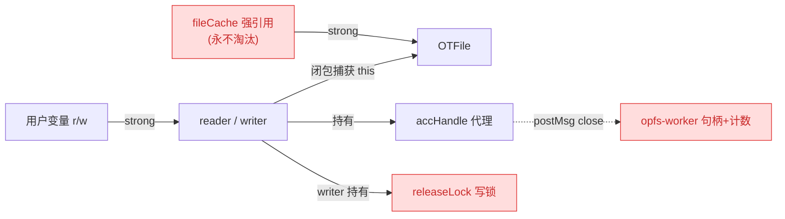
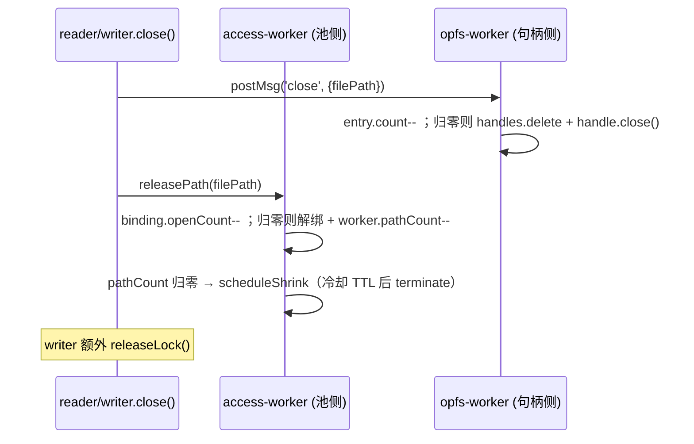
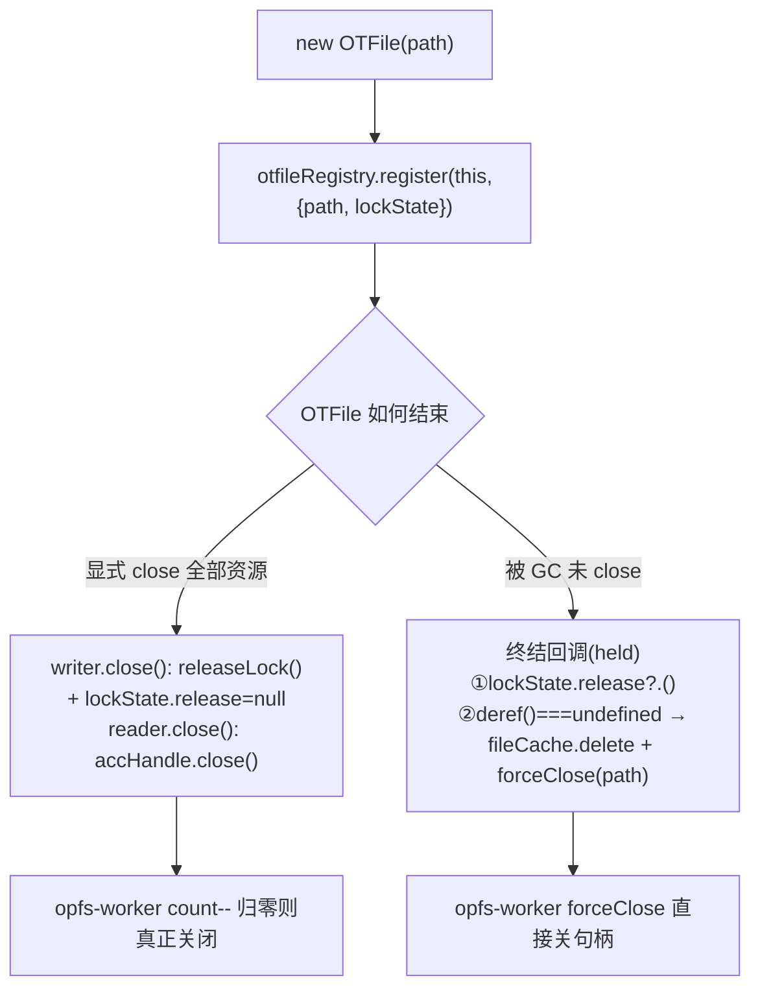
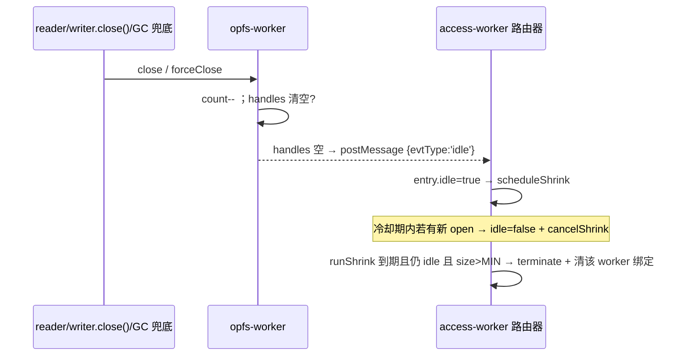
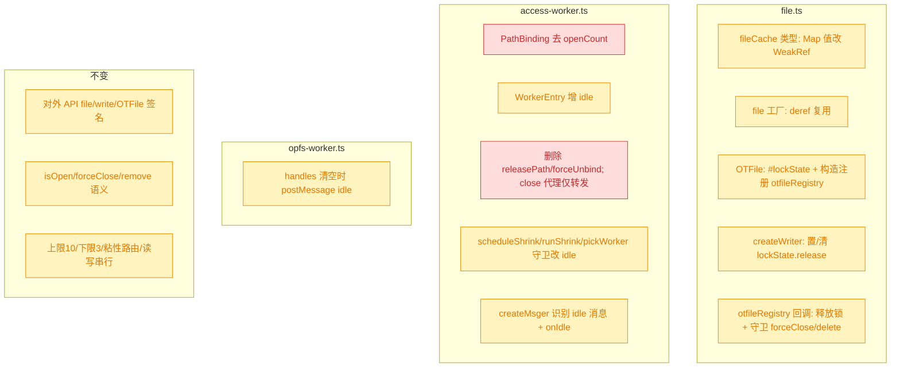
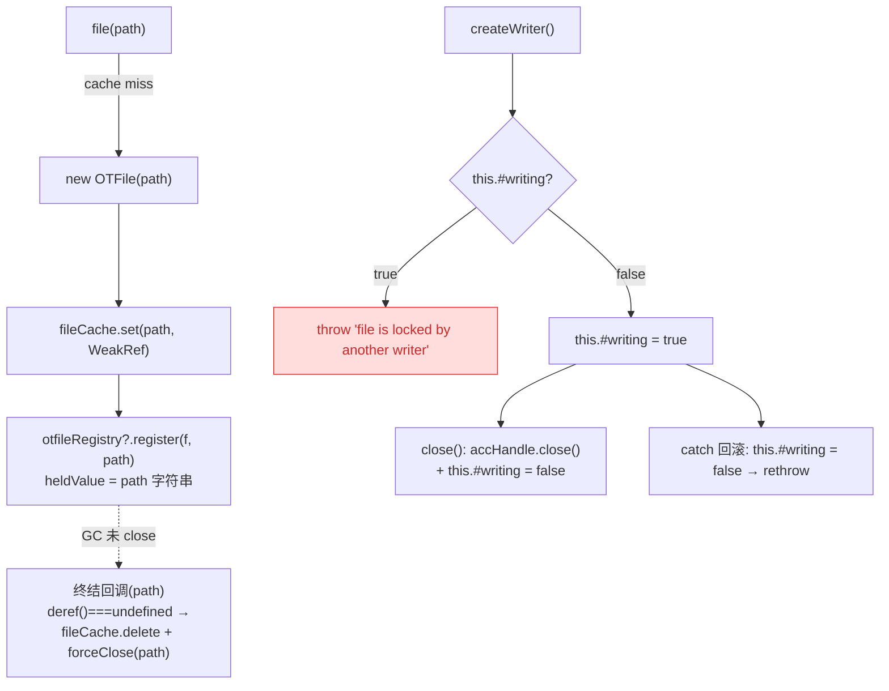

# OTFile 弱引用化与句柄/Worker 自动回收

## 1. 背景

`src/file.ts` 的 `file(filePath)` 工厂把每一个创建过的 `OTFile` 实例**强引用**写进模块级 `fileCache: Map<string, OTFile>`（`file.ts:28-32`），且无任何淘汰逻辑——进程存活期内只增不减，`OTFile` 实例与 path 字符串永不回收。

更严重的是资源泄漏链：`OTFile.createReader()` / `createWriter()` 返回的 reader/writer 对象持有 `accHandle`（指向 Worker 句柄的消息代理），writer 还额外持有一把 origin 级写锁 `releaseLock`。只有显式调用 `close()` 才会：

- 递减 `opfs-worker` 内该 path 的句柄引用计数，归零才真正 `close()` `SyncAccessHandle`；
- 递减 `access-worker` 池侧计数，归零才让 Worker 进入空闲冷却、最终 `terminate()`；
- （writer）释放写锁。

用户反馈（`file.ts:179-184` 的 writer.close / 整条链路）：**若用户忘记或意外未能 `close()`**，上述计数永不归零——`access-worker` 中的 Worker 实例无法被销毁，`opfs-worker` 中的 `SyncAccessHandle` 也无法关闭（writer 的写锁同样泄漏）。

用户希望借助 `WeakRef` + `FinalizationRegistry`（见 MDN WeakRef / FinalizationRegistry）做一道兜底安全网：当对象被垃圾回收时，自动清理 `fileCache` 缓存条目并确保 `opfs-worker` 中的文件句柄被关闭；同时简化池侧计数——**移除 `access-worker` 的 `openCount`**，改由 `opfs-worker` 在「该 Worker 所有句柄都已关闭」时发送一个空闲信号给 `access-worker`，由 `access-worker` 启动冷却回收倒计时。

## 2. 需求

- `fileCache` 不再强引用 `OTFile`：允许 `OTFile` 在无人使用时被 GC；被回收时自动清除其 `fileCache` 条目。
- reader/writer 若未显式 `close()` 而被 GC：自动关闭其在 `opfs-worker` 中占用的句柄引用；writer 额外自动释放写锁。
- 移除 `access-worker` 的 `openCount`（`PathBinding.openCount`）；`opfs-worker` 在其句柄 Map 清空时向 `access-worker` 发送空闲信号，`access-worker` 据此启动冷却回收倒计时。
- 保持既有对外 API 不变：`file` / `write` / `OTFile` 的方法签名与语义不变；显式 `close()` 仍是推荐路径，自动回收仅作兜底。
- 保持既有不变量：同一 `filePath` 粘性路由到同一 Worker、上限 10 / 下限 3、读写串行、`isOpen`/`forceClose`/`remove` 行为不变。

## 3. 现状分析

### 3.1 资源持有与引用拓扑

关键事实：`createReader`/`createWriter` 返回的闭包方法体内使用 `this.#path`，因而**闭包隐式捕获了 `OTFile` 实例**（`this`）。所以「reader/writer 存活 ⇒ 其 OTFile 存活」；反之 OTFile 被回收 ⇒ 其全部 reader/writer 也已不可达。但**单个 reader/writer 被回收时，若同 path 仍有其它存活 reader/writer，OTFile 不会被回收**——这是选择回收锚点（OTFile 级 vs reader/writer 级）的关键依据（见 §5）。

精确层：引用与泄漏点源码位置

- `src/file.ts:5` `const fileCache = new Map<string, OTFile>();`
- `src/file.ts:28-32` `file()`：`fileCache.get(p) ?? new OTFile(p)` 后 `fileCache.set(p, f)`——强引用、无淘汰。
- `src/file.ts:147-190` `createWriter()`：`acquireWriteLock` → `releaseLock`；返回的 `write/truncate/flush/close` 均引用 `this.#path`（捕获 `this`），`close()` 内 `accHandle.close()` + `releaseLock()`。
- `src/file.ts:196-219` `createReader()`：返回 `read/getSize/close`，`close()` 内 `accHandle.close()`（无写锁）。
- 泄漏三要素：① `fileCache` 永驻；② 未 close ⇒ `opfs-worker` 句柄计数不归零；③ 未 close ⇒ writer 写锁不释放。

### 3.2 当前关闭 / 计数数据流（三层计数）

同一次 `close()` 触发三处计数协同下降，任一泄漏都会卡住后续回收：

精确层：三层计数字段与函数

- `opfs-worker.ts:7-10` `handles: Map<path, { handleP, count }>`；`open` 累加（`:45`）、`close` 递减归零则 `handle.close()`（`:54-61`）、`forceClose` 无视计数直接关（`:62-69`）、`isOpen` 读 `count>0`（`:70-71`）。
- `access-worker.ts:48-52` `PathBinding = { workerId, openCount }`；`:95-105` `bindNewPath`、`:146-158` `releasePath`、`:160-170` `forceUnbind`。
- `access-worker.ts:40-46` `WorkerEntry = { msger, pathCount, shrinkTimer? }`；`:118-143` 冷却状态机 `scheduleShrink`/`runShrink`/`cancelShrink`。
- `access-worker.ts:226-233` writer/reader `close` 代理 → `pm('close')` + `releasePath`。
- `file.ts:265-277` `remove()`：force 走 `forceClose`+`remove`+`fileCache.delete`；非 force 先 `isOpen` 校验。

### 3.3 池侧 `openCount` 与 Worker 内 `count` 的冗余

`access-worker` 的 `PathBinding.openCount` 本质是 `opfs-worker` 内 `handles[path].count` 的**主线程镜像**：两者在 open/close 同步增减、语义等价。`isOpen` 已经直接向 Worker 查询真实 `count`（`opfs-worker.ts:70-71`），说明 Worker 侧才是真相源。镜像的代价：① 代码双份维护易漂移；② 未 close 时两份一起泄漏，兜底回收要同时修两处。这正是用户提出「移除 openCount、改由 Worker 发空闲信号」的动机。

## 4. 技术实现方案

总体两块改造，彼此解耦：A. `fileCache` 弱引用化 + 单个 OTFile 级 `FinalizationRegistry`（缓存淘汰 + 句柄 forceClose + 写锁释放，由用户抉择的「OTFile 级锚点」统一承载）；C. 移除池侧 `openCount`、`opfs-worker` 空闲信号驱动冷却。

> 决策记录：待确认项「句柄/写锁自动回收的锚点选在哪一级？」—— 用户选择「方案 1：仅 OTFile 级（`fileCache` 弱引用，OTFile 被回收时 `forceClose` 该 path 句柄）」，非推荐的方案 2（reader/writer 级精确计数兜底）。据此：句柄/写锁兜底全部下沉到 OTFile 级终结回调，不再引入 reader/writer 级 `rwRegistry`；代价是只能 `forceClose`（无法按单资源精确递减），且同 path 存在其它存活资源时须等整个 OTFile 不可达才回收——此为方案 1 固有代价，用户已接受。

### 4.1 A：fileCache 弱引用化 + OTFile 级 FinalizationRegistry（缓存淘汰 + 句柄 forceClose）

- `fileCache: Map<string, WeakRef<OTFile>>`。`file(p)`：`cache.get(p)?.deref()` 命中即复用；为空（从未创建或已被 GC）则 `new OTFile(p)`、`cache.set(p, new WeakRef(f))`。
- OTFile **构造时**以自身为锚点注册到 `otfileRegistry`，heldValue 携带 `{ path, lockState }`（`lockState` 见 §4.2，容器不回指 OTFile，不妨碍其被回收）。
- `otfileRegistry = new FinalizationRegistry((held) => { ... })`：OTFile 被 GC（其全部 reader/writer 亦已不可达）时触发，回调依次执行：
  1. **写锁兜底释放**（§4.2）：`if (lockState.release != null) { lockState.release(); lockState.release = null; }`。
  2. **缓存淘汰 + 句柄 forceClose**：**仅当 `fileCache.get(path)?.deref() === undefined`**（该 path 已无存活 OTFile）时，`fileCache.delete(path)` 且 `postToOPFS(path, 'forceClose')`（fire-and-forget，不 await）；否则说明同 path 已有新实例，跳过以免误删新缓存条目 / 误关新实例句柄。
- 环境守卫：`const otfileRegistry = typeof FinalizationRegistry !== 'undefined' ? new FinalizationRegistry(cb) : null;`，注册处 `otfileRegistry?.register(...)`；运行时缺失时退化为「无自动兜底，仍需显式 close」。
- `remove(force)` 的 `fileCache.delete` 保留；非 force 的 `isOpen` 校验不变（仍问 Worker）。

> 决策记录：淘汰/forceClose 回调用「`deref() === undefined` 才执行」而非无条件执行，理由：FinalizationRegistry 回调时机不确定，旧实例的终结回调可能晚于「同 path 新实例已写入 cache」，无条件删除/forceClose 会误伤新实例。被否决备选：注册时以 `WeakRef` 自身为 heldValue 做全等比较——等价但多存一个对象，`deref()===undefined` 更简。
>
> 决策记录：forceClose 系 fire-and-forget（终结回调不能 async await）；opfs-worker `forceClose` 对不存在的 entry 天然 no-op、access-worker 侧亦无副作用残留，故重复/迟到的 forceClose 安全。

### 4.2 B：OTFile 级写锁兜底释放（lockState 容器）

用户选定 OTFile 级锚点后，writer 的 origin 写锁释放也必须挂到 OTFile 终结回调。难点：`releaseLock` 是 `createWriter` 的闭包变量，而终结回调（heldValue）**不能回指**正被回收的 OTFile。解法是引入一个 OTFile 持有的**可变容器** `lockState = { release: null }`，既供 OTFile 在 writer 开/关时写入，又作为 heldValue 的一部分交给注册表（容器本身不回指 OTFile）：

- OTFile 增私有字段 `#lockState = { release: null as (() => void) | null }`；构造时随 `otfileRegistry.register(this, { path: this.#path, lockState: this.#lockState })` 一并登记。
- `createWriter` 抢到写锁后置 `this.#lockState.release = releaseLock`；`close()` 与异常回滚分支在调用 `releaseLock()` 之后置 `this.#lockState.release = null`（避免终结回调重复释放）。
- 终结回调：`if (lockState.release != null) { lockState.release(); lockState.release = null; }`——**无需 deref 守卫**：同 path 写锁互斥（`acquireWriteLock` 对已锁 path 直接抛错），若存在泄漏 writer 仍持锁，则同 path 新实例根本抢不到锁、不可能有第二持有者，故释放必然安全。
- `createReader` 不涉及写锁，无需 lockState；其泄漏句柄的兜底关闭由 §4.1 的 `forceClose(path)` 统一覆盖。

> 局限（方案 1 固有代价，用户已接受）：锚点在 OTFile 级 ⇒ 当同 path 仍有其它存活 reader/writer、或 OTFile 本身仍被引用时，单个泄漏资源要等整个 OTFile 不可达才被 `forceClose`/释放锁；且句柄只能 `forceClose`（无法按单资源精确递减计数）。若同 path 旧实例已 GC、新实例已建且持句柄，旧实例的终结回调被 §4.1 的 `deref()` 守卫拦下、跳过 forceClose，旧实例遗留的句柄计数滞留到新实例亦不可达时才清——有界、自愈。

### 4.3 C：移除 openCount，opfs-worker 空闲信号驱动冷却

- **数据结构**：`PathBinding` 去掉 `openCount`，退化为纯路由 `{ workerId }`。`WorkerEntry` 以 `idle: boolean` 取代用 `pathCount` 判空闲的角色；`pathCount` 保留为「当前绑定到该 Worker 的 path 数」仅供负载均衡（`pickWorkerForNewPath`），在 `bindNewPath` 时 `++`、在该 Worker `terminate` 清绑定时归零。既然计数职责移除，**`releasePath` 与 `forceUnbind` 整体删除**（它们原本只做 openCount/pathCount 递减与解绑）。
- **opfs-worker → access-worker 空闲信号**：`opfs-worker` 在 `handles` 由非空变为空（最后一个句柄 `close`/`forceClose` 完成）时，`postMessage` 一条**非回调**消息（如 `{ evtType: 'idle' }`，无 `cbId`）。`createMsger` 的 `onmessage` 识别该类消息并回调路由器 `onIdle(workerId)`。
- **access-worker 侧**：
  - `createOPFSAccess` 的 `close()` 代理不再调 `releasePath`——仅转发 `pm('close')`，池侧不再计数。
  - `createOPFSAccess` 的 `open` 成功后，同步置目标 `entry.idle = false` + `cancelShrink(workerId)`（新 path 绑定或已绑定 path 复用两种情形都要置）。
  - **open 失败回滚**：原先靠 `releasePath` 回滚。新模型下仅当本次调用**新建了绑定**（原 `binding == null`）时，`pathBindings.delete(filePath)` 并 `scheduleShrink(workerId)`（该 Worker 可能因此回到可冷却态）；复用已存在绑定的失败不动绑定。
  - `postToOPFS('forceClose')` 去掉对 `forceUnbind` 的调用，仅转发 `forceClose` 消息；绑定清理交由后续 `idle` 信号 → 冷却 → `terminate` 完成。
  - 收到 `idle(workerId)`：置 `entry.idle = true` 并 `scheduleShrink(workerId)`。
  - `scheduleShrink` 守卫由 `pathCount>0` 改为 `!entry.idle`；`runShrink` 到期若仍 `entry.idle` 且 `workers.size > MIN_WORKERS` 才 `terminate`，并**连带清除该 Worker 名下所有 `pathBindings`**（此刻 idle 成立 ⇒ 无存活句柄 ⇒ 清绑定安全）。
  - `pickWorkerForNewPath` 判空闲由 `pathCount===0` 改为 `entry.idle`：优先复用 idle Worker（其 `pathCount` 可能因滞留绑定而非 0，但 idle 成立即可安全复用）；非 idle 者按 `pathCount` 最小复用。
- **竞态处理（决策）**：「空闲信号晚于新 open」被 `idle=false` 兜住——新 open 在主线程同步置 `idle=false`，即便 `idle` 信号此后到达也只是把 `idle` 置回 true 并 `scheduleShrink`，而下一个到该 Worker 的 open 会再次 `cancelShrink`；真正 `terminate` 只发生在 `runShrink` 到期**且**期间无任何新 open（`idle` 持续为 true）。清绑定只在 `terminate` 时做，故不会误删正被使用的 path 绑定。

> 决策记录：采用用户指定的「Worker 级」空闲信号（句柄全闭才发一次），而非「每 path 关闭各发一次」。代价：某 Worker 承载多 path 时，已关闭但 Worker 未整体空闲的 path 其 `pathBindings` 条目会滞留到该 Worker 整体空闲（`terminate` 或下次复用）才清；此为有界、自愈的轻微冗余，换取信令最简。

### 4.4 兼容性 / 影响范围

- 🔴 breaking（仅内部）：`PathBinding.openCount` 移除、`releasePath`/`forceUnbind` 删除——`__test__` 导出的测试桩（`access-worker.test.ts`）依赖 `pathBindings`/`pathCount`/`scheduleShrink`/`fakeEntry` 等，需同步更新（去 openCount、改 idle 驱动）；无对外 API 破坏。
- 🟡 affected：`file.ts`（fileCache/OTFile/createWriter/新注册表）、`access-worker.ts`、`opfs-worker.ts` 的上述函数；`__test__` 需新增 `idle` 相关导出（`onIdle` 等）以便单测。
- 环境降级：不支持 `WeakRef`/`FinalizationRegistry` 的运行时需保底——目标浏览器（OPFS SyncAccessHandle 需 Chrome 102+）均已支持二者，故仅在缺失时跳过注册（`typeof FinalizationRegistry !== 'undefined'`），行为退化为「无自动兜底，仍需显式 close」，不报错。

### 4.5 D：移除 writer Web 锁，改用 OTFile 实例级 `#writing` 字段

现状（`file.ts:107-143,189-237`）：`createWriter` 通过 `acquireWriteLock` 抢占 origin 级 Web Lock（`navigator.locks`，无则退化为进程内 `localWriteLocks` Set），并把 `releaseLock` 存入 `#lockState` 容器，供 GC 终结回调兜底释放。链路涉及：`acquireWriteLock`/`WRITER_LOCK_PREFIX`/`localWriteLocks`、`#lockState` 字段、`OTFinalizeHeld.lockState`、终结回调第 1 步「写锁兜底释放」。

追加需求的关键事实：`file()` 已对同一 path 返回**同一** `OTFile` 缓存实例（§4.1）；只要存在未关闭的 writer，其闭包捕获 `this` 使该 OTFile 不可 GC，故 `file(path)` 持续命中同一实例。因此「同一 tab 内单写者互斥」只需一个**实例级布尔标志**即可表达，无需 origin 级外部锁。

改造：

- OTFile 新增私有字段 `#writing = false`，**删除** `#lockState`。
- `createWriter()` 入口：`if (this.#writing) throw Error('file is locked by another writer: ' + this.#path)`；随后置 `this.#writing = true`。错误文案保持不变（`file.test.ts:85` 的断言沿用）。
- writer `close()`：在 `accHandle.close()` 后置 `this.#writing = false`（替代原 `releaseLock()` + 清 `#lockState`）。
- `createWriter` 的 `catch` 回滚分支：置 `this.#writing = false` 后 rethrow（替代原 `releaseLock()`）。
- **删除** `acquireWriteLock`、`WRITER_LOCK_PREFIX`、`localWriteLocks` 及其全部引用。
- **register 下沉到 `file()`**：OTFile 构造函数不再 `otfileRegistry?.register`；改由 `file()` 在 `fileCache.set(...)` 后 `otfileRegistry?.register(f, filePath)`。heldValue 由 `{ path, lockState }` 简化为**纯 `path` 字符串**，`OTFinalizeHeld` 类型删除，`FinalizationRegistry<string>`。
- 终结回调简化为**仅两步缓存淘汰**（删除「写锁兜底释放」整步）：`if (fileCache.get(path)?.deref() === undefined) { fileCache.delete(path); postToOPFS(path, 'forceClose'); }`。`#writing` 是实例内状态，随实例被 GC 一并消失、无外部资源可泄漏，故无需终结兜底；泄漏句柄仍由 `forceClose` 关闭。

> 决策记录：追加任务「移除 writer 锁，用 #writing 替代」—— 用户指定重构，直接采用。理由与自查证：§4.1 已保证同一 path 同一缓存实例，实例级 `#writing` 足以覆盖「同 tab 内避免多个 writer 对象并存」；写锁兜底释放整步因外部锁消失而自然消解，终结回调与 register 逻辑随之简化。
>
> 决策记录（跨 tab 语义降级，自查证后接受）：原 origin Web Lock 额外提供**跨 tab** 写互斥并以统一文案 `file is locked by another writer` 早抛错；移除后跨 tab 第二写者的互斥下沉到浏览器 OPFS 层——`createSyncAccessHandle` 对已被独占的文件抛 `NoModificationAllowedError`（时机更晚、文案不同）。`file()` 文档注释原已声明「跨 tab 同时打开同一文件仍受 OPFS 独占锁限制」，故跨 tab 仍安全、仅错误形态变化；此为用户重构的固有取舍，已接受并记录，不作待确认项。
>
> 决策记录（register 下沉 file() 的边界）：直接 `new OTFile(path)`（绕过 `file()` 的非文档路径）将不被注册，失去缓存淘汰/forceClose 兜底；但此类实例本就不入 `fileCache`、无缓存可淘汰，仅少一次 GC 兜底 forceClose，属可接受边界，推荐路径 `file()` 不受影响。

精确层：删除/改动点源码位置

- 删除 `file.ts:107-143`（`WRITER_LOCK_PREFIX`/`localWriteLocks`/`acquireWriteLock`）。
- 删除 `file.ts:10-13` `OTFinalizeHeld` 类型；`file.ts:17-33` 终结回调去掉第 1 步锁释放、heldValue 改 `string`。
- 删除 `file.ts:170` `#lockState` 字段；新增 `#writing = false`。
- `file.ts:178-182` 构造函数内 register 移除；`file.ts:56-62` `file()` 内新增 register。
- `file.ts:190-192,227-229,233-234` 写锁获取/释放/容器清理 → 改 `#writing` 置位/复位。

### 4.6 E：PathBinding 退化为裸 `workerId`（`Map<string, number>`）

现状（`access-worker.ts:51-57`）：`PathBinding = { workerId: number }` 仅剩单字段（openCount 已在上一轮移除），`pathBindings: Map<string, PathBinding>` 为每条绑定多包一层对象，纯冗余。

改造：

- 删除 `PathBinding` 类型；`pathBindings` 改为 `Map<string, number>`（path → workerId）。
- 写入点 `bindNewPath`（`:115`）：`pathBindings.set(filePath, workerId)`。
- 读取点统一改为直接取 number：
  - `routeTo`（`:122-126`）：`const workerId = pathBindings.get(filePath); if (workerId == null) return null; return workers.get(workerId)?.msger.postMsg ?? null;`
  - `runShrink`（`:150-151`）、`handleWorkerFatal`（`:197-199`）：`for (const [filePath, wid] of pathBindings) if (wid === workerId) pathBindings.delete(filePath);`
  - `createOPFSAccess`（`:212-216`）：`const bound = pathBindings.get(filePath); const isNewBinding = bound == null; const workerId = isNewBinding ? bindNewPath(filePath) : (markBusy(bound), bound);`
- `__test__` 导出不变（仍暴露 `pathBindings`），但测试内写法同步改为 `pathBindings.set('/a', 1)`。

> 决策记录：追加任务「PathBinding 只用 workerId，无需保留对象」—— 用户指定重构，直接采用。openCount 已移除后该对象退化为单字段包装，裸 number 等价且更省；无语义变化、无外部 API 影响。

## 5. 待确认项

_暂无_

## 6. 任务清单

- [x] file.ts：`fileCache` 改为 `Map<string, WeakRef<OTFile>>`，`file()` 经 `deref()` 复用、未命中则 `new OTFile` 并 `set(new WeakRef(f))`（验收：`tsc -p tsconfig.build.json` 通过；同一 path 在实例存活期内 `file(p)===file(p)`）
- [x] file.ts：新增带 `typeof FinalizationRegistry !== 'undefined'` 守卫的 `otfileRegistry`，OTFile 构造时 `otfileRegistry?.register(this,{path,lockState})`；回调执行「①`lockState.release?.()` 并置 null ②`deref()===undefined` 时 `fileCache.delete(path)`+`postToOPFS(path,'forceClose')`」（验收：tsc 通过；回调含 `deref()===undefined` 守卫与锁释放两步）
- [x] file.ts：OTFile 增私有 `#lockState={release:null}`，`createWriter` 抢锁后置 `#lockState.release=releaseLock`、`close()` 与异常回滚分支在 `releaseLock()` 后置 `#lockState.release=null`（验收：tsc 通过；正常 close 后 release 为 null 不重复释放）
- [x] opfs-worker.ts：`close`/`forceClose` 删除 entry 后若 `handles.size===0`，`postMessage({evtType:'idle'})`（无 cbId）（验收：构建通过；仅在由非空变空时发送）
- [x] access-worker.ts：`PathBinding` 去 `openCount`（退化 `{workerId}`），`WorkerEntry` 增 `idle:boolean`，删除 `releasePath`/`forceUnbind`（验收：tsc 通过；`grep openCount src/access-worker.ts` 为空）
- [x] access-worker.ts：`createOPFSAccess` 的 `close` 代理仅转发不再 releasePath；`open` 成功后置目标 `entry.idle=false`+`cancelShrink`；open 失败仅在本次新建绑定时 `pathBindings.delete`+`scheduleShrink`；`postToOPFS('forceClose')` 去掉 `forceUnbind`（验收：tsc 通过）
- [x] access-worker.ts：`createMsger.onmessage` 识别无 `cbId` 的 `idle` 消息并回调 `onIdle(workerId)`；`onIdle` 置 `entry.idle=true`+`scheduleShrink`（验收：单测触发 idle 后进入冷却）
- [x] access-worker.ts：`scheduleShrink`/`runShrink` 守卫由 `pathCount>0` 改为 `!entry.idle`，`runShrink` terminate 时清除该 worker 名下全部 `pathBindings`；`pickWorkerForNewPath` 空闲判定由 `pathCount===0` 改为 `entry.idle`（验收：单测覆盖 idle→ 冷却 →terminate→ 清绑定）
- [x] access-worker.test.ts：同步 `__test__` 用例——`fakeEntry` 去 pathCount 用途改注入 `idle`，移除 openCount 断言，新增 `onIdle`/idle 驱动冷却用例（验收：`vitest run src/__tests__/access-worker.test.ts` 全绿）
- [x] 全量验证：运行 `npm test`（vitest）与 `npm run build`（验收：两者退出码 0）
- [x] file.ts（D）：删除 `acquireWriteLock`/`WRITER_LOCK_PREFIX`/`localWriteLocks`；OTFile 删 `#lockState`、增 `#writing=false`；`createWriter` 入口 `#writing` 守卫抛 `file is locked by another writer`、置位，`close()` 与 catch 回滚复位（验收：`grep -n "acquireWriteLock\|WRITER_LOCK_PREFIX\|localWriteLocks\|#lockState" src/file.ts` 为空；tsc 通过）
- [x] file.ts（D）：register 下沉到 `file()`（构造函数移除注册），终结回调 heldValue 改纯 `path` 字符串、删 `OTFinalizeHeld` 类型与「写锁兜底释放」步，仅保留 `deref()===undefined` 守卫下的 `fileCache.delete`+`forceClose`（验收：tsc 通过；`FinalizationRegistry<string>`；构造函数内无 register）
- [x] access-worker.ts（E）：删除 `PathBinding` 类型，`pathBindings` 改 `Map<string, number>`；`bindNewPath`/`routeTo`/`runShrink`/`handleWorkerFatal`/`createOPFSAccess` 全部按裸 workerId 读写（验收：`grep -n "PathBinding\|\.workerId" src/access-worker.ts` 为空；tsc 通过）
- [x] access-worker.test.ts（E）：`pathBindings.set` 的值由 `{ workerId: n }` 改为 `n`（验收：`vitest run src/__tests__/access-worker.test.ts` 全绿）
- [x] 全量验证（refct）：运行 `npm test` 与 `npm run build`（验收：两者退出码 0；`file.test.ts` 的「write operation is exclusive」仍通过）

## 7. 追加任务

- [fixed] [refct] 2026-10-07 20:44:17 | 1. @src/file.ts:L190 移除 writer 锁，使用 this.#writing 字段替代，避免同时存在多个 writer 对象，简化 otf
  - 描述：1. @src/file.ts:L190 移除 writer 锁，使用 this.#writing 字段替代，避免同时存在多个 writer 对象，简化 otfileRegistry?.register 逻辑，应该在 file 函数中调用 register；

2. @src/access-worker.ts:L51-L54 PathBinding 只是使用 workerId 即可，没必要保留一个对象

## 8. 执行记录

- 2026-10-07 20:28 | file.ts 弱引用化：`fileCache` 改 `Map<string, WeakRef<OTFile>>`，`file()` 用 `deref()` 复用；新增环境守卫的 `otfileRegistry`（回调：写锁释放 → `deref()===undefined` 守卫下 `fileCache.delete`+`postToOPFS(forceClose)`）；OTFile 增 `#lockState` 容器，构造时注册、`createWriter` 置/清 release。验证：`tsc -p tsconfig.build.json` 退出 0。
- 2026-10-07 20:28 | opfs-worker.ts：新增 `emitIdleIfEmpty`，在 `close`/`forceClose` 关闭句柄后若 `handles.size===0` 发 `{evtType:'idle'}`（无 cbId）。验证：构建通过。
- 2026-10-07 20:28 | access-worker.ts：`PathBinding` 去 openCount、`WorkerEntry` 增 `idle`；删除 `releasePath`/`forceUnbind`，新增 `markBusy`/`onIdle`/`unbindFailedOpen`；`pickWorkerForNewPath`/`scheduleShrink`/`runShrink` 守卫改 `idle`，`runShrink` terminate 连带清绑定；`createMsger` 增 `onIdle` 参数并识别 idle 消息；`createOPFSAccess` close 代理仅转发、open 置忙与新建绑定失败回滚；`postToOPFS(forceClose)` 去 forceUnbind；`__test__` 增 `onIdle`。验证：`grep openCount src` 仅剩注释。
- 2026-10-07 20:28 | 测试与构建：改写 `access-worker.test.ts` 为 idle 驱动（11 用例）。`vitest run` 全量 48 用例通过；`npm run build`（vite build + tsc + gen-api）退出 0。
- 2026-10-07 20:28 | 收尾：全部非 manual 任务完成，待确认项 `_暂无_`、无批注、无追加任务，标记 `done`。
- 2026-10-07 20:52 | 追加任务（refct）D：file.ts 移除 Web 写锁链路（`acquireWriteLock`/`WRITER_LOCK_PREFIX`/`localWriteLocks` 全删），OTFile 以实例级 `#writing` 字段替代 `#lockState` 做单写者互斥（`createWriter` 守卫抛 `file is locked by another writer` + 置位，`close()`/catch 回滚复位）；`otfileRegistry.register` 下沉到 `file()`，heldValue 由 `{path,lockState}` 简化为纯 `path`，`FinalizationRegistry<string>`，终结回调删去写锁释放步、仅保留 `deref()===undefined` 守卫下的 `fileCache.delete`+`forceClose`；同步更新 `file()` JSDoc 描述为实例级互斥。
- 2026-10-07 20:52 | 追加任务（refct）E：access-worker.ts 删除 `PathBinding` 类型，`pathBindings` 由 `Map<string, PathBinding>` 退化为 `Map<string, number>`（裸 workerId）；`bindNewPath`/`routeTo`/`runShrink`/`handleWorkerFatal`/`createOPFSAccess` 全部改按 number 读写；`access-worker.test.ts` 的 `pathBindings.set` 值由 `{workerId:n}` 改为 `n`。
- 2026-10-07 20:52 | 验证：`grep` 确认 file.ts 无 `acquireWriteLock/WRITER_LOCK_PREFIX/localWriteLocks/#lockState/OTFinalizeHeld`、access-worker.ts 无 `PathBinding/.workerId`；`npx vitest run` 全量 48 用例通过（file.test.ts 22 含「write operation is exclusive」、access-worker.test.ts 11）；`npm run build`（vite build + tsc + gen-api）退出 0。
- 2026-10-07 20:52 | 收尾：两项追加任务置 `[fixed]`，任务清单非 manual 项全 `[x]`，待确认项 `_暂无_`、无批注，标记 `done`。
