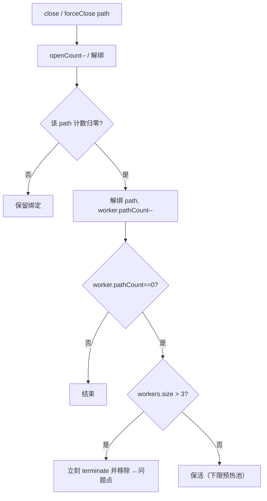
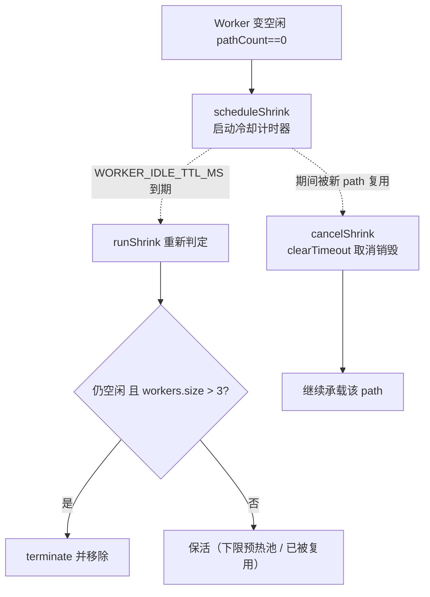
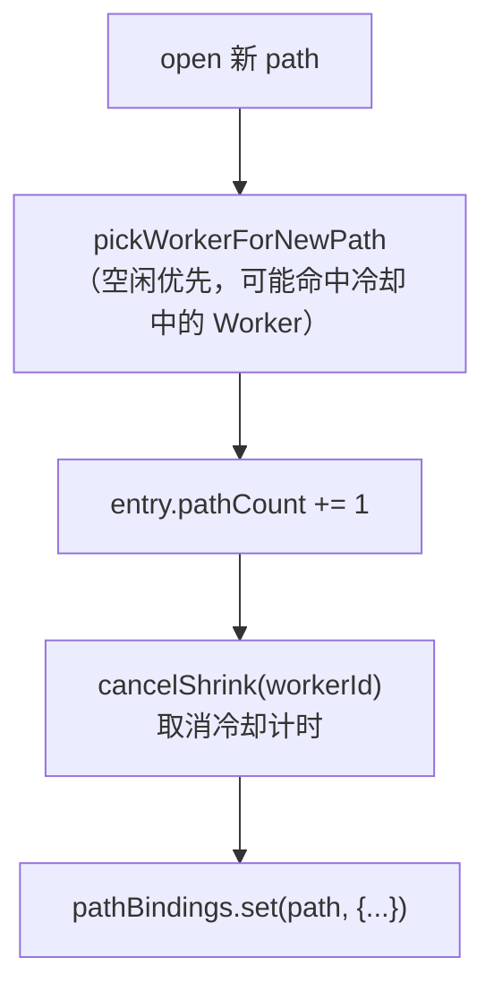
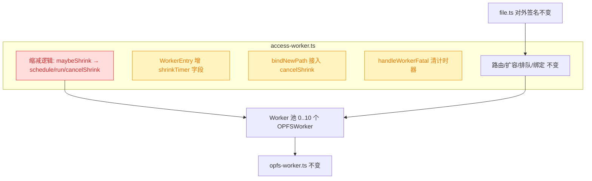
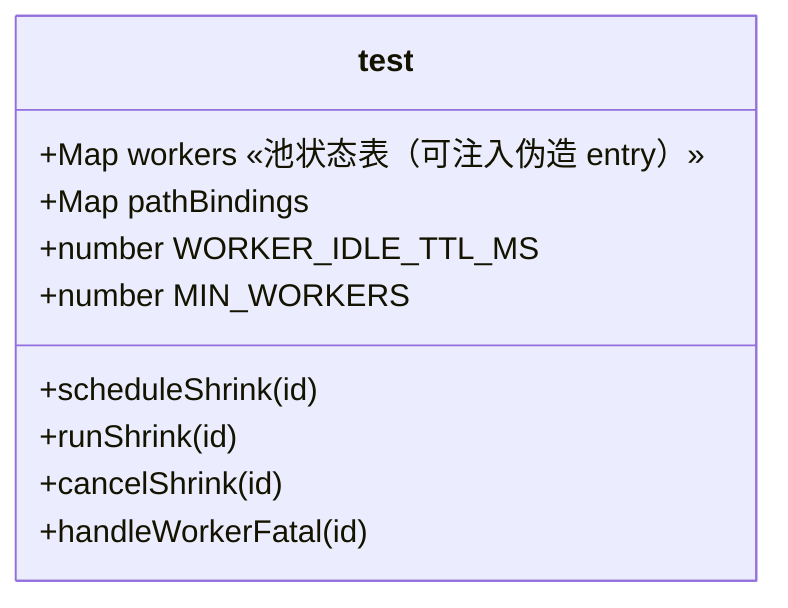

# 空闲 Worker 延时冷却销毁

## 1. 背景

在 `261007.feat.dynamic-worker-pool` 中，`src/access-worker.ts` 已实现动态 Worker 池（0→ 最多 10，空闲缩减至下限 3）与 path 粘性路由。当前缩减策略是 `maybeShrink`：某 Worker 的 `pathCount` 一旦归零（且 `workers.size > MIN_WORKERS`）就**立刻** `terminate()` 并移除。

用户反馈：**创建 Worker 也有成本**（线程/内存分配、worker 脚本加载、冷启动抖动）。在「打开 → 关闭 → 很快再打开」这类抖动场景下，立刻销毁会导致下一次访问又要重新 `new OPFSWorker()`，白白付出重建成本。

用户希望：空闲 Worker **逐渐冷却关闭**、最终回归到预留的 3 个常驻实例，而**不是** `pathCount` 归零就立刻关闭。

## 2. 需求

- 空闲 Worker（`pathCount===0`）不再在归零瞬间 `terminate`，改为进入「冷却」：延时一段时间后若仍空闲再销毁。
- 冷却期内该 Worker 若被新 path 复用，取消其冷却计时，不销毁。
- 缩减下限保持 **3**：无论冷却与否，`workers.size` 恒不低于 `MIN_WORKERS=3`。
- 其余不变量保持：同一 `filePath` 粘性路由到同一 Worker、上限 10、排队语义、对外 API（`createOPFSAccess` / `postToOPFS`）签名不变、`opfs-worker.ts` 与 `file.ts` 不改。

## 3. 现状分析

### 3.1 当前缩减数据流

`src/access-worker.ts` 的池状态：`workers: Map<workerId, { msger, pathCount }>`、`pathBindings: Map<filePath, { workerId, openCount }>`。缩减发生在两处「path 解绑后 Worker 变空闲」的时机，均直接调用 `maybeShrink`：

- `releasePath`（`close` 或 `open` 失败回滚）：`openCount` 归零 → 解绑 path、`pathCount--` → 若 `pathCount===0` 调 `maybeShrink`。
- `forceUnbind`（`forceClose`）：直接解绑 path、`pathCount--` → 若 `pathCount===0` 调 `maybeShrink`。

`maybeShrink(workerId)`：若该 Worker 仍空闲且 `workers.size > MIN_WORKERS`，立刻 `terminate()` + `workers.delete()`；否则保活（下限预热池）。

### 3.2 问题点与改造切入面

- **问题**：`maybeShrink` 的「立刻 terminate」在 close→reopen 抖动下反复销毁/重建 Worker，付出不必要的创建成本。
- **切入面**：仅需把「空闲即销毁」替换为「空闲延时冷却销毁」，不触碰路由/绑定/扩容逻辑。改造集中在：缩减时机函数（`maybeShrink` 改造 + 新增冷却计时管理）、复用时取消计时、Worker 死亡/销毁时清理计时。

现状精确信息（文件 / 行号 / 入口）

- 常量与数据模型：`src/access-worker.ts:34-35`（`MAX_WORKERS=10`/`MIN_WORKERS=3`）、`:37-47`（`WorkerEntry`/`PathBinding`）、`:49-51`（`workers`/`pathBindings`/`workerSeq`）。
- 立刻销毁：`src/access-worker.ts:107-115`（`maybeShrink`：`entry.msger.terminate()` + `workers.delete(workerId)`）。
- 变空闲的两处调用点：`:117-130`（`releasePath`，`:127` 调 `maybeShrink`）、`:132-142`（`forceUnbind`，`:140` 调 `maybeShrink`）。
- 复用点（需取消计时）：`:72-84`（`pickWorkerForNewPath`，空闲 Worker 优先复用）、`:90-98`（`bindNewPath`，`entry.pathCount += 1`）。
- Worker 死亡清理：`:148-153`（`handleWorkerFatal`）。
- 消息器：`:243-290`（`createMsger`，返回 `{ postMsg, terminate }`）。
- `opfs-worker.ts` / `file.ts`：不改。

## 4. 技术实现方案

在 `access-worker.ts` 内把「立刻销毁」替换为「延时冷却销毁」：Worker 变空闲时启动一个冷却计时器（`WORKER_IDLE_TTL_MS`），到期后**重新判定**（仍空闲且 `workers.size > MIN_WORKERS`）才销毁；冷却期内被复用则取消计时。路由、绑定、扩容、排队、下限 3 的语义全部不变。

### 4.1 冷却模型与数据模型增量

`WorkerEntry` 增加一个可空的冷却计时器句柄 `shrinkTimer`；其余字段不变。新增常量 `WORKER_IDLE_TTL_MS`（冷却时长，单位 ms）。

类型与常量增量（实施参考）

- `WorkerEntry` 增加字段：`shrinkTimer?: ReturnType<typeof setTimeout>`（主线程定时器，允许为空表示当前无冷却计时）。
- 新增模块常量：`const WORKER_IDLE_TTL_MS = 10_000;`（见 4.5 决策记录）。
- `workers`/`pathBindings`/`workerSeq`/`MAX_WORKERS`/`MIN_WORKERS` 均不变。

### 4.2 冷却计时的三个动作

把原 `maybeShrink` 的「同步判定 + 立刻销毁」拆成「调度冷却」「到期执行」「取消冷却」三个动作：

- `scheduleShrink(workerId)`：Worker 变空闲时调用。若已有计时器则不重复安排（或重置，等价）；否则 `setTimeout(runShrink, WORKER_IDLE_TTL_MS)` 并记入 `entry.shrinkTimer`。**不在此刻判定下限**——判定推迟到到期时，因为期间池大小可能变化。
- `runShrink(workerId)`（计时器回调）：清掉 `shrinkTimer` 引用后**重新判定**：该 Worker 仍存在、`pathCount===0` 且 `workers.size > MIN_WORKERS` → `terminate()` + `delete`；否则保活（成为下限预热池的一员）。
- `cancelShrink(workerId)`：Worker 被复用（`pathCount` 从 0 升到 1）时调用，`clearTimeout(entry.shrinkTimer)` 并清空引用。

### 4.3 复用时取消冷却的接入点

冷却期内的 Worker `pathCount` 仍为 0，故 `pickWorkerForNewPath` 的「空闲优先复用」会优先选中它——这正是冷却带来的收益：抖动重开直接命中正在冷却的 Worker，省去重建。接入点放在 `bindNewPath`：选定 Worker 并 `pathCount += 1` 后，调用 `cancelShrink(workerId)` 清掉可能存在的冷却计时（Worker 已重新有负载，不应再被销毁）。

### 4.4 与死亡/销毁的交互

- `runShrink` / `terminate`：销毁 Worker 前不需额外清计时器（计时器正在回调中或已 `clearTimeout`），`delete` 后 `entry` 失去引用自然回收。
- `handleWorkerFatal(workerId)`：Worker `onerror` 清理时，若该 `entry` 存在挂起的 `shrinkTimer`，先 `clearTimeout` 再 `delete`，避免计时器到期后对已移除的 workerId 空跑（`runShrink` 内已做存在性判定兜底，但提前清理更干净）。

### 4.5 影响面

- 🔴 breaking（内部实现，对外 API 不破坏）：`maybeShrink` 的「立刻销毁」语义被「延时冷却销毁」取代。
- 🟡 affected：`WorkerEntry` 增字段；`bindNewPath` 增 `cancelShrink` 调用；`handleWorkerFatal` 增清计时器。
- 不变：路由/扩容/排队/绑定/下限 3/上限 10；`opfs-worker.ts`、`file.ts`、对外 API 签名。

### 4.6 已自行决策的点（非待确认项）

- **冷却时长 `WORKER_IDLE_TTL_MS = 10_000`（10 秒）**：取舍为「吸收常见 close→reopen 抖动」与「不长期占用超额线程/内存」之间的工程默认值。它是一个模块级常量、改一行即可调整（可逆），故不设为待确认项；若后续实测需要再调。
- **逐渐冷却 = 每个 Worker 独立计时**：各 Worker 在各自变空闲的时刻起算独立计时器，天然错峰到期而「逐渐」回落；到期时按 `workers.size > MIN_WORKERS` 顺序判定，JS 单线程串行执行使其自然收敛到下限 3（不额外引入「每隔 N 秒关一个」的错峰调度器，避免过度设计）。
- **到期时判定下限而非调度时判定**：冷却期间池大小可能变化（新 path 扩容 / 其他 Worker 先销毁），故把 `workers.size > MIN_WORKERS` 的判定推迟到 `runShrink` 执行时，保证下限 3 恒成立。
- **已有计时器不重复安排**：`scheduleShrink` 对已在冷却的 Worker 不重置计时（空闲状态连续，无需延长），实现简单且不影响下限正确性。

### 4.7 单元测试补充方案（追加任务）

本次冷却改造的核心是 `scheduleShrink`/`runShrink`/`cancelShrink` 三函数构成的状态机，以及 `bindNewPath`（复用取消计时）、`handleWorkerFatal`（死亡清计时）两个接入点。现有测试（`src/__tests__/*.test.ts`）全部是经公开 API（`file`/`write`/`dir`）的浏览器集成测试，**无法观测**冷却这一纯内部行为——Worker 是否「延时销毁 / 被复用保活 / 到期重判定」从对外 API 不可见，且真实 TTL=10s 不适合在集成测试里实时等待。

**测试策略**：对 `access-worker.ts` 的池状态机做**确定性单元测试**，用 vitest 的 fake timers 控制 `WORKER_IDLE_TTL_MS` 的推进，用伪造的 `WorkerEntry`（`terminate` 为 `vi.fn()` 间谍）直接驱动状态机，避免创建真实 `OPFSWorker`。

**可测性接入（最小源码改动，不破坏对外 API）**：在 `access-worker.ts` 末尾新增**测试专用导出** `__test__`，聚合内部的 `workers`/`pathBindings` 两张表、常量 `WORKER_IDLE_TTL_MS`/`MIN_WORKERS`、以及 `scheduleShrink`/`runShrink`/`cancelShrink`/`handleWorkerFatal` 四函数。它不经 `index.ts` 再导出、`gen-api.js` 只解析 `file/directory/tmpfile` 的 d.ts、`tsconfig.build` 排除 `__tests__`，故对发布产物与公开 API 零影响。

**用例矩阵**（分支对应 4.2/4.3/4.4）：

| #   | 场景                                           | 断言                                                                                |
| --- | ---------------------------------------------- | ----------------------------------------------------------------------------------- |
| 1   | 空闲且 `size>MIN`：scheduleShrink 后未到期     | 不立刻 terminate、`shrinkTimer` 非空；推进 TTL 后 terminate 1 次且从 `workers` 删除 |
| 2   | 到期时 `size==MIN`（下限保活）                 | 推进 TTL 后不 terminate、entry 保留、`shrinkTimer` 被清空                           |
| 3   | 冷却期被复用（`pathCount++`+cancelShrink）     | `shrinkTimer` 清空；推进 TTL 后不 terminate、entry 保留                             |
| 4   | 已在冷却重复 scheduleShrink                    | 第二次不新建计时，`shrinkTimer` 句柄不变                                            |
| 5   | 到期时 `pathCount>0`（未 cancel 但已有负载）   | runShrink 重判定保活，不 terminate                                                  |
| 6   | 对非空闲（`pathCount>0`）Worker scheduleShrink | 不安排计时，`shrinkTimer` 保持 undefined                                            |
| 7   | `handleWorkerFatal` 清理挂起计时器             | 立即删除 entry 与其名下 path 绑定；推进 TTL 后不触发 terminate（计时器已清）        |

## 5. 待确认项

_暂无_

## 6. 任务清单

- [x] 在 `WorkerEntry` 增加可空字段 `shrinkTimer?: ReturnType<typeof setTimeout>`，并新增模块常量 `WORKER_IDLE_TTL_MS = 10_000`（验收：`npx tsc -p tsconfig.json --noEmit` 通过，类型完整）
- [x] 新增 `scheduleShrink`/`runShrink`/`cancelShrink` 三函数替换 `maybeShrink` 立刻销毁逻辑：`scheduleShrink` 空闲时 setTimeout 记入 `shrinkTimer`（已有则不重复安排）、`runShrink` 到期清引用后重判定（仍空闲且 `workers.size > MIN_WORKERS` 才 terminate+delete）、`cancelShrink` clearTimeout 并清空引用（验收：tsc 通过，逻辑覆盖 4.2 分支）
- [x] 将 `releasePath`/`forceUnbind` 内对 `maybeShrink` 的调用改为 `scheduleShrink`（验收：path 解绑后 Worker 变空闲时进入冷却而非立刻 terminate）
- [x] 在 `bindNewPath` 的 `entry.pathCount += 1` 之后调用 `cancelShrink(workerId)`（验收：复用冷却中 Worker 时取消其销毁计时）
- [x] 在 `handleWorkerFatal` 中 `delete` 前 `clearTimeout` 该 Worker 的 `shrinkTimer`（验收：onerror 清理后无残留计时器空跑）
- [x] 运行类型检查与构建/测试并记录结果（验收：`npx tsc -p tsconfig.json --noEmit` 通过；`npm run build` 与 `npm test` 尽力执行并登记结果或环境限制）
- [x] 在 `src/access-worker.ts` 末尾新增测试专用导出 `__test__`（聚合 `workers`/`pathBindings`/`WORKER_IDLE_TTL_MS`/`MIN_WORKERS`/`scheduleShrink`/`runShrink`/`cancelShrink`/`handleWorkerFatal`），不经 `index.ts` 再导出（验收：`npx tsc -p tsconfig.json --noEmit` 通过；`index.ts` 导出不变、API 无变化）
- [x] 新增 `src/__tests__/access-worker.test.ts`，用 fake timers 覆盖 4.7 用例矩阵 7 条（1 到期销毁 / 2 下限保活 / 3 复用取消 / 4 不重复安排 / 5 到期重判定保活 / 6 非空闲不安排 / 7 fatal 清计时），每条用伪造 entry 驱动、`terminate` 为 `vi.fn()` 间谍，`beforeEach` 清空两表并 `useFakeTimers`（验收：`npx tsc -p tsconfig.json --noEmit` 通过，断言覆盖 4.2/4.3/4.4 全分支）
- [x] 运行类型检查与测试并记录结果（验收：`npx tsc -p tsconfig.json --noEmit` 通过；`npm test` 尽力执行并登记结果或环境限制）
- [x] 将 `src/__tests__/access-worker.test.ts` 的 8 条 `test(...)` 用例描述由中文改为英文，仅改描述文案、不改测试逻辑（验收：`npm test` 全绿，用例名全部为英文）

## 7. 追加任务

- [fixed] [refct] 2026-10-07 18:15:31 | 补充单元测试用例
  - 描述：补充单元测试用例
- [fixed] [refct] 2026-10-07 20:55:00 | 测试用例名称（描述）使用英文
  - 描述：测试用例名称（描述）使用英文

## 8. 执行记录

- 2026-10-07：实施冷却改造。`src/access-worker.ts` 中 `WorkerEntry` 增加 `shrinkTimer?` 字段、新增常量 `WORKER_IDLE_TTL_MS=10_000`；删除原立刻销毁的 `maybeShrink`，新增 `scheduleShrink`（空闲时 setTimeout 记入 `shrinkTimer`，已有则不重复安排）/`runShrink`（到期清引用后重判定，仍空闲且 `workers.size>MIN_WORKERS` 才 terminate+delete）/`cancelShrink`（clearTimeout 并清空）；`releasePath`/`forceUnbind` 的缩减调用改为 `scheduleShrink`；`bindNewPath` 在 `pathCount += 1` 后调 `cancelShrink` 以复用冷却中的 Worker；`handleWorkerFatal` 在 delete 前 clearTimeout。
- 验证：`grep maybeShrink` 无残留；`git diff --stat` 确认仅 `src/access-worker.ts` 改动（+37/-6），`src/opfs-worker.ts`/`src/file.ts` 未改动、对外 API 签名不变；`npx tsc -p tsconfig.json --noEmit` 通过；`npm run build` exit 0；`npm test`（@vitest/browser）全绿，5 文件 37 用例全部通过。
- 2026-10-07：收尾。全部非 manual 任务完成，待确认项 `_暂无_`、无 `！！！` 批注、无 `[open]` 追加任务，`stage` 置为 `done`。
- 2026-10-07（追加任务·补充单元测试）：变更重开流程消费 `[open] [refct] 补充单元测试用例`。plan 分析出冷却状态机（`scheduleShrink`/`runShrink`/`cancelShrink` + `bindNewPath` 复用取消 + `handleWorkerFatal` 清计时）无法经公开 API 观测，定方案为确定性单元测试 + fake timers（见 4.7）。实施：`src/access-worker.ts` 末尾新增测试专用导出 `__test__`（聚合 `workers`/`pathBindings`/`WORKER_IDLE_TTL_MS`/`MIN_WORKERS` 及四函数，不经 `index.ts` 再导出，对发布产物与对外 API 零影响）；新增 `src/__tests__/access-worker.test.ts`，用伪造 `WorkerEntry`（`terminate` 为 `vi.fn()`）+ `vi.useFakeTimers()` 驱动，覆盖 4.7 用例矩阵并补 1 条 `runShrink` 兜底空跑用例，共 8 条。
- 验证：`npx tsc -p tsconfig.json --noEmit` 通过；`npx vitest run src/__tests__/access-worker.test.ts` 8 条全绿；`npx vitest run` 全量 6 文件 45 用例全绿（原 37 + 新增 8，directory.test 的 stderr 为该用例预期错误断言，非回归）。追加项 `[open] → [fixed]`。
- 2026-10-07：追加任务收尾。全部非 manual 任务完成，待确认项 `_暂无_`、无 `！！！` 批注、无 `[open]` 条目，`stage` 置为 `done`。
- 2026-10-07（追加任务·测试用例描述英文化）：将 `src/__tests__/access-worker.test.ts` 的 8 条 `test(...)` 描述由中文改为英文（如 `空闲且高于下限：冷却到期后才 terminate 并移除` → `idle and above floor: terminates and removes only after cooldown elapses` 等），仅改描述文案，测试逻辑/断言一字未动。验证：`npx vitest run` 全量 6 文件 45 用例全绿。追加项 `[open] → [fixed]`。
- 2026-10-07：追加任务收尾（英文化）。全部非 manual 任务完成，待确认项 `_暂无_`、无 `！！！` 批注、无 `[open]` 条目，`stage` 保持 `done`。
