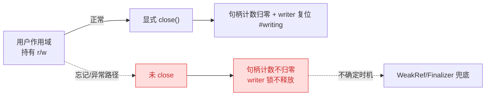
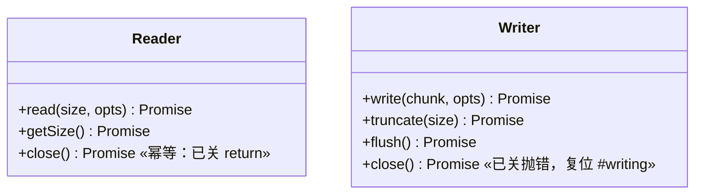
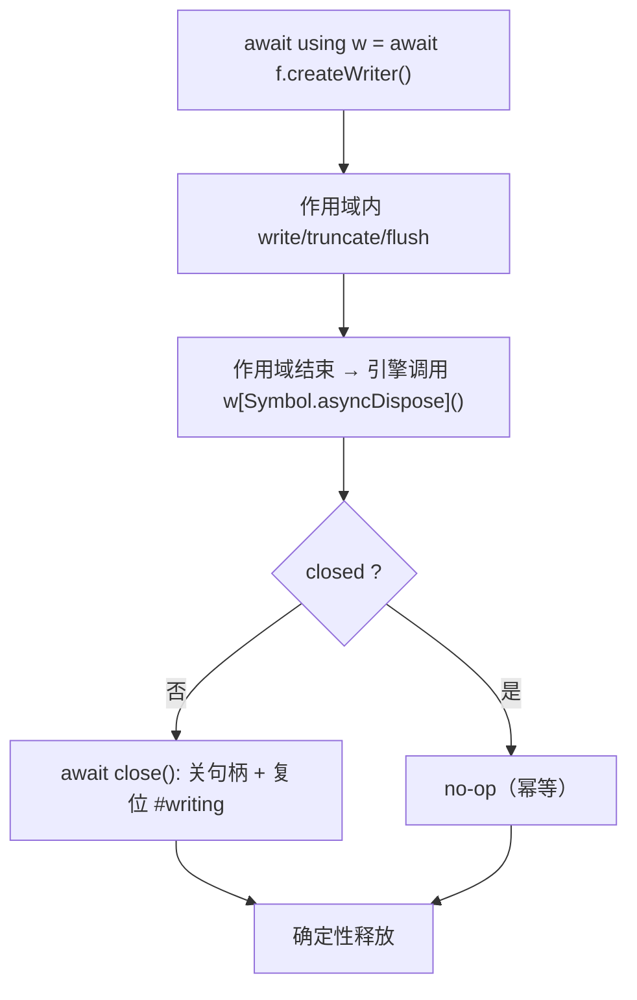
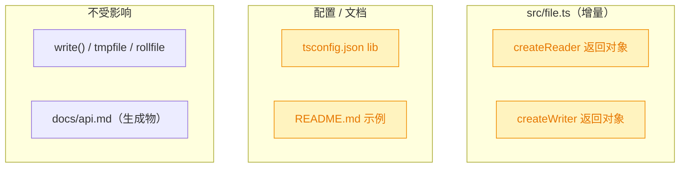

# reader/writer 支持 using 协议（显式资源管理 / dispose）

## 1. 背景

`src/file.ts` 的 `OTFile.createReader()` / `createWriter()` 返回的 reader/writer 对象持有 Worker 侧的 `accHandle`；只有显式调用 `close()` 才会递减句柄引用计数、最终关闭 `SyncAccessHandle`，writer 的 `close()` 还负责把实例级 `#writing` 单写者互斥标记复位。

一旦用户忘记 / 异常路径漏掉 `close()`，句柄计数不归零、writer 锁不释放（这正是姊妹 spec `261007.refct.otfile-weakref-gc` 用 `WeakRef`+`FinalizationRegistry` 兜底的泄漏链）。GC 兜底是「不确定时机」的安全网，无法替代「作用域结束即确定释放」。

TC39「显式资源管理」(Explicit Resource Management) 已落地：对象实现 `[Symbol.asyncDispose]()` 后即可用 `await using r = ...` 声明，使其在作用域结束时**确定性**地自动释放。用户希望为 reader/writer 实现该协议，并在 `README.md` 使用说明中示范新用法。

## 2. 需求

- 为 `createReader()` / `createWriter()` 返回对象实现 `[Symbol.asyncDispose]`，使其可被 `await using` 自动关闭（内部复用既有 `close()` 语义）。
- `[Symbol.asyncDispose]` 必须**幂等**：与显式 `close()` 任意组合、重复触发都不得抛错或重复关闭句柄。
- 不改变既有对外 API：`read` / `getSize` / `write` / `truncate` / `flush` / `close` 的签名与语义保持不变；显式 `close()` 仍是推荐路径，`await using` 为可选增强。
- 更新 `README.md`（现 L31 reader 示例一带）示范 `await using` 用法。
- 补齐 TypeScript 类型：源码引用 `Symbol.asyncDispose` 可编译、消费者 `await using` 可类型通过。

## 3. 现状分析

reader/writer 均为 `createReader/createWriter` 内闭包返回的**普通对象**（非类实例），`close` 捕获闭包内 `closed` 标志与 `accHandle`。关键差异：**reader.close 幂等（已关直接 return），writer.close 对已关句柄抛错**——这是实现幂等 dispose 时两者需区别处理的根因。

精确层：reader/writer 返回结构与 close 行为源码位置

- `src/file.ts:129-174` `createWriter()`：闭包变量 `closed`、`accHandle`；返回 `{ write, truncate, flush, close }`。`close`（`:163-168`）`if (closed) throw ...` → `closed = true` → `await accHandle.close()` → `this.#writing = false`。**已关再调用会抛错**。
- `src/file.ts:179-202` `createReader()`：返回 `{ read, getSize, close }`。`close`（`:196-200`）`if (closed) return`（幂等）→ `closed = true` → `await accHandle.close()`。
- 消费方：`src/rollfile.ts:7-8`、`src/tmpfile.ts:17`、`src/__tests__/file.test.ts`、`directory.test.ts` 均走显式 `createReader/createWriter` + `close`；`src/file.ts:70-90` `write()` 在 `finally` 内 `writer.close()`。新增 `[Symbol.asyncDispose]` 为**纯增量**，不影响上述现有调用。
- `tsconfig.json`：`target: ES2020`，`lib: ["ES2022","DOM","DOM.Iterable"]`——**不含** `Symbol.asyncDispose` 的类型声明（需 `ESNext.Disposable`）。TypeScript 本地版本 5.5.3，`lib.esnext.disposable.d.ts` 可用。

### 3.1 reader/writer 现有返回结构

## 4. 技术实现方案

在两处闭包返回对象上新增 `[Symbol.asyncDispose]` 方法，内部委托既有 close 语义；reader 直接复用其幂等 `close`，writer 以 `closed` 守卫保证幂等（避免 writer.close 的「已关抛错」污染 `await using` 的作用域退出路径）。同步增补 TS 类型与 README 示例。

> 决策记录（决策 + 理由 + 被否决备选）：
>
> 1. **用 `Symbol.asyncDispose`（异步）而非 `Symbol.dispose`（同步）**：`accHandle.close()` 为异步，`await using` 能等待其完成；被否决备选——同步 `using`+`Symbol.dispose` 无法 await 句柄关闭，句柄可能仍悬挂。
> 2. **幂等实现分治**：reader 的 `[Symbol.asyncDispose]` 直接复用幂等 `close`；writer 需在 dispose 内加 `if (!closed)` 守卫后再 `close`，防止「先手动 close 再作用域退出」二次关闭抛错。不改动 writer.close 自身「已关抛错」的既有对外语义（保持向后兼容）。
> 3. **`tsconfig.json` 的 `lib` 追加 `"ESNext.Disposable"`**：获得 `Symbol.asyncDispose`/`AsyncDisposable` 类型声明；纯增量、不改 `target`，`tsconfig.build.json` 继承生效。
> 4. **范围边界**：仅改 `src/file.ts` + `README.md` + `tsconfig.json`。`docs/api.md` 由 `build` 的 `gen-api.js` 生成，不手改；`tmpfile.ts`/`rollfile.ts`/`write()` 内部使用 writer 不受影响（仅新增方法）。
> 5. **README 更新**：在现 reader/writer 示例（L23、L31 一带）追加 `await using` 用法示范，保留原显式 `close` 路径说明。
> 6. **守卫式全局 polyfill**：在 `src/file.ts` 顶部加 `(Symbol as any).asyncDispose ??= Symbol.for('Symbol.asyncDispose')`，保证旧运行时（有 OPFS、无 `Symbol.asyncDispose`：Chrome 102~118 / Safari 16.4~17.3）符号存在后再挂载计算键，避免 `undefined` 退化为脏键 `"undefined"`；代价是库写入全局 `Symbol`（幂等、`??=` 不覆盖已有）。
>
> 决策记录：待确认项「`Symbol.asyncDispose` 在旧运行时缺失时的挂载策略」—— 用户选择「守卫式全局 polyfill `Symbol.asyncDispose ??= Symbol.for('Symbol.asyncDispose')`」，理由：兼容旧运行时且类型非可选，接受库写入全局 `Symbol` 的代价；被否决备选——① 直接挂载不 polyfill（旧区间失效且产生脏键）、③ 条件挂载（无全局副作用但返回类型该方法变可选，消费者 `await using` 需额外断言）。

### 4.1 改造影响面（语义配色）

精确层：新增返回类型与实现要点

- 文件顶部守卫式 polyfill：`(Symbol as { asyncDispose?: symbol }).asyncDispose ??= Symbol.for('Symbol.asyncDispose')`，置于 import 之后、首次使用计算键之前。
- reader 返回新增：`[Symbol.asyncDispose]: () => Promise<void>`，实现为 `() => close()`（`close` 已幂等）。
- writer 返回新增：`[Symbol.asyncDispose]: async () => { if (!closed) await close(); }`。
- 类型效果：`ReturnType<typeof f.createReader>` / `createWriter`（`rollfile.ts:7-8` 使用）自动包含该方法，消费者 `await using` 满足 `AsyncDisposable`。
- 验收：`tsc -p tsconfig.build.json` 通过；`vitest` 全绿；新增用例覆盖「`await using` 作用域退出自动关闭」与「dispose + 显式 close 幂等不抛错」。

## 5. 待确认项

_暂无_

## 6. 任务清单

- [x] 在 `src/file.ts` import 之后、首次使用计算键之前加守卫式全局 polyfill `(Symbol as { asyncDispose?: symbol }).asyncDispose ??= Symbol.for('Symbol.asyncDispose')`（验收：`tsc -p tsconfig.build.json` 通过，不覆盖已有符号）
- [x] 为 `createReader()` 返回对象新增 `[Symbol.asyncDispose]: () => close()`，复用其幂等 `close`（验收：`await using` 退出自动关句柄）
- [x] 为 `createWriter()` 返回对象新增 `[Symbol.asyncDispose]: async () => { if (!closed) await close(); }`，以 `closed` 守卫保证幂等（验收：先手动 `close` 再作用域退出不抛错）
- [x] 在 `tsconfig.json` 的 `lib` 追加 `"ESNext.Disposable"`（验收：源码引用 `Symbol.asyncDispose` 与消费者 `await using` 类型通过）
- [x] 更新 `README.md` reader/writer 示例（L23、L31 一带）追加 `await using` 用法，保留原显式 `close` 路径说明（验收：示例语法正确、与源码 API 一致）
- [x] 在 `src/__tests__/file.test.ts` 新增用例：`await using` 作用域退出自动关闭、dispose 与显式 `close` 任意组合幂等不抛错（验收：`vitest` 全绿）
- [x] 运行 `tsc -p tsconfig.build.json` 与 `vitest` 验证全部通过（验收：类型检查 + 测试均通过）

## 7. 执行记录

- `src/file.ts`：import 后新增守卫式 polyfill `(Symbol as {...}).asyncDispose ??= Symbol.for('Symbol.asyncDispose')`。
- `src/file.ts` `createReader()`：将原内联 `close` 提取为局部 `const close`（保持幂等语义），返回对象新增 `close` 与 `[Symbol.asyncDispose]: close`（dispose 即幂等 close）。
- `src/file.ts` `createWriter()`：返回对象新增 `[Symbol.asyncDispose]`，以 `if (!closed)` 守卫后内联关句柄 + 复位 `#writing`（因对象字面量内无法以裸名引用兄弟属性 `close`，故内联而非 `await close()`）；`close` 自身「已关抛错」语义保持不变（向后兼容）。
- `tsconfig.json`：`lib` 追加 `"ESNext.Disposable"`，获得 `Symbol.asyncDispose`/`AsyncDisposable` 类型声明。
- `README.md`：reader/writer 示例追加 `await using` 自动释放用法，保留原显式 `close` 路径。
- `src/__tests__/file.test.ts`：新增 4 条用例——writer/reader `await using` 作用域退出自动关闭、writer/reader dispose 与显式 close 任意组合及重复触发幂等不抛错。
- 验证：`tsc -p tsconfig.build.json` 与 `tsc -p tsconfig.json`（含测试）均 exit 0；`vitest run` 6 文件 52 用例全绿（file.test.ts 26 条含新增 4 条）。directory.test.ts 的 stderr 为既有用例有意触发的「unclosed reader/writer」日志，非回归。
- 收尾：任务清单非 manual 项全部完成，待确认项为 `_暂无_`、无批注，标记 done。
